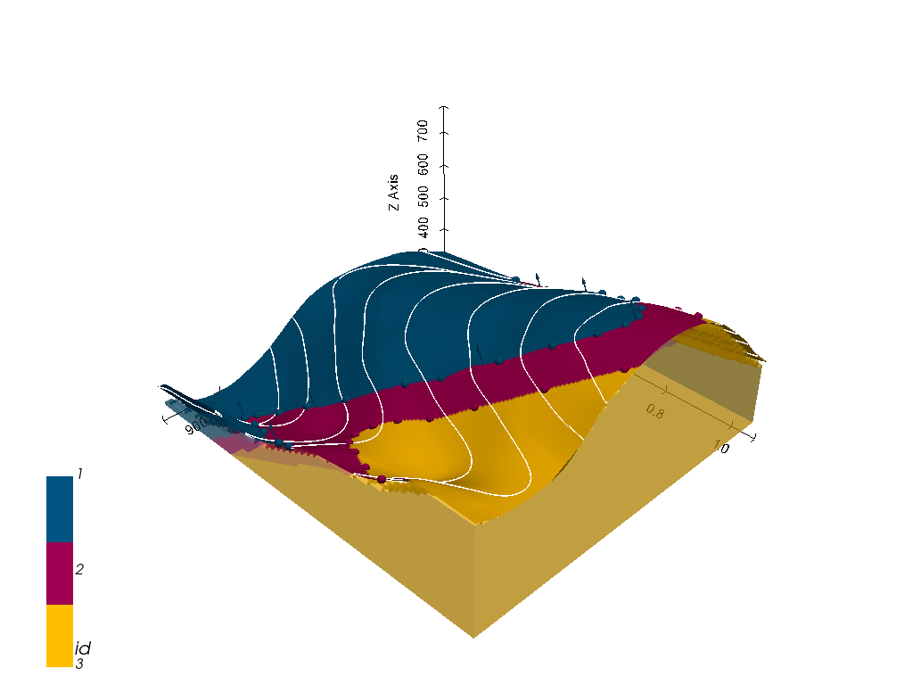

# GemGIS

> Geographic data and information processing for geomodeling

## Overview 

`GemGIS` is a Python-based, **open-source geographic information processing library**. It is capable of preprocessing spatial data such as vector data (shape files, geojson files, geopackages), raster data, data obtained from WMS services or XML/KML files. Preprocessed data can be stored in a dedicated Data Class to be passed to the geomodeling package [GemPy](https://github.com/cgre-aachen/gempy) in order to accelerate the model building process. Postprocessing of model results will allow export from `GemPy` to geoinformation systems such as QGIS and ArcGIS or to Google Earth for further use. 

`GemGIS` uses the full functionality of [GeoPandas](https://geopandas.org/), [rasterio](https://rasterio.readthedocs.io/en/latest/#), [OWSLib](https://geopython.github.io/OWSLib/), [Pandas](https://pandas.pydata.org/), [Shapely](https://shapely.readthedocs.io/en/latest/manual.html), [PyVista](https://docs.pyvista.org/) and [NumPy](https://numpy.org/).

All provided maps and examples were taken from the books 'Interpretation of Geological Structures Through Maps: An Introductory Practical Manual' by D. Powell and "An Introduction to Geological Structures and Maps" by G.M. Bennison referenced at the bottom. Many code examples were developed as part of the Master Thesis of Alexander Jüstel as referenced below and will now be provided and improved for use in `GemGIS`.
## Table of Contents

* [Installation](#installation)
* [Features](#features)
  * [Structure of Package](#structure)
  * [Extracting Data from Vector Files](#vector)
  * [Extracting Data from Raster Files](#raster)
  * [Extracting Data from Online Services](#wms)
  * [Extracting Data from Maps](#maps)
  * [Extracting Data from XML/KML Files](#xml/kml)
  * [Visualization of Data in PyVista](#pyvista)
  * [Utility Tools](#utils)
  * [Postprocessing of GemPy geo_model data](#post)
* [Documentation](#doc)
* [References](#ref)

## Installation
Due to rasterio, `GemGIS` must be used with **python==3.8.5**. It is recommended to create a new environment for the use of `GemGIS` and to use conda-forge to install packages like `geopandas` and `rasterio`.

1) `conda install -c conda-forge geopandas`
2) `conda install -c conda-forge rasterio`
3) `pip install gemgis`

## Structure of Package

The core of `GemGIS` is made of the `GemPyData` class (`gemgis.py`). Its attributes can directly be utilized by `GemPy` making it easier for users to load data. Methods of the `GemPyData` class allow users to directly set these attributes. Multiple other files contain functions to manipulate vector data, raster data, etc.:

* `gemgis.py` - core file containing the `GemPyData` class
* `vector.py` - file containing functions to manipulate vector data
* `raster.py` - file containing functions to manipulate raster data
* `utils.py` - file containing utility functions frequently used for the manipulation of vector/raster data
* `wms.py` - file containing methods to load WMS services as arrays/rasters
* `visualization.py` - file containing functions to simplify plotting of spatial data
* `postprocessing.py` - file containing functions to postprocess GemPy geo_model data
* `notebooks` - folder containing tutorial notebooks explaining the features of `GemGIS` and example notebooks applying these features

## Features

### Extracting Data from Vector Files

Data stored as points, lines or polygons as shape-files, geopackages or geojson files can easily be imported into `GemGIS` GeoPandas GeoDataFrames. X and Y coordinates can then be extracted for these objects for direct use in `GemPy`. Digital elevation models can be interpolated if contour lines with height values are provided. If the loaded exceeds the desired modeling/working area extent, the data can be cropped. 

### Extracting Data from Raster Files

Rasters (stored as arrays in Python) such as digital elevation models store height information. The height of interface points can be extracted from these rasters. In addition, if a raster represents a layer in the subsurface, orientation values can be sampled for use in `GemPy`. Orientations are calculated via the slope and aspect of the provided raster. It is also possible to resize rasters, clip rasters or save rasters as referenced geotiffs again. 

### Extracting Data from Online Services

Online services provide a wide range of possibilities to work with spatial data. Currently, it is possible to load data from WMS services into `GemGIS`. The functionality will be extended to WCS and WFS services in the future.

### Extracting Data from Maps
Besides extracting interface points from already existing digital data, `GemGIS` makes it easy to use the data digitized from georeferenced maps. This includes the extraction of interface points but also the calculation of orientations for the modeling with `GemPy` based on the gradient of isolines. In addition, it is possible to extract the real world coordinates from georeferenced cross sections to use this data for geological modeling with `GemPy`.

### Extracting Data from XML/KML Files
XML/KML Data export will be available in the future. 

### Visualization of Data in PyVista
`PyVista` is the main 3D visualization package of `GemPy`. In order for new users to get used to the package, it is possible to plot the input data as a `PyVista` plot. This includes plotting depth maps of surfaces extracted from `GemPy`, plotting georeferenced cross sections of geological maps at their true position in space, plot boreholes and their respective lithology in 3D, plot a topographic map with height information in 3D and many more features to come.

### Utility Tools
`GemGIS` offers a wide range of utility tools. These includes 
* Conversion of vector data into custom sections directly usable in `GemPy`
* Conversion of GeoDataFrames into Pandas DataFrames for `GemPy`
* Setting the extent and resolution for a `GemPy` model based on vector data and lists
* Load and save QGIS style files (QML) for use as a color_dict in `GemPy`
* Calculate orientations based on strike lines
* Interpolate missing strike lines to calculate orientations
* Read CSV files as GeoDataFrames
* and many more to come

### Postprocessing of GemPy geo_model data
`GemGIS` also offers postprocessing methods to use data from the `GemPy` model. These include:
* Export of the geological map as a shape file
* Extract boreholes from `GemPy` models
* Create depth maps of surfaces
* and many more to come

## Documentation

## References

* Jüstel, A.: 3D Probabilistic Modeling and Data Analysis of the Aachen-Weisweiler Area: Implications for Deep Geothermal Energy Exploration, unpublished Master Thesis at RWTH Aachen University, 2020
* de la Varga, M., Schaaf, A., and Wellmann, F.: GemPy 1.0: open-source stochastic geological modeling and inversion, Geosci. Model Dev., 12, 1-32, https://doi.org/10.5194/gmd-12-1-2019, 2019
* Powell, D.: Interpretation of Geological Structures Through Maps: An Introductory Practical Manual, Longman, pp. 192, 1992
* Bennison, G.M.: An Introduction to Geological Structures and Maps, Hodder Education Publication, pp. 78, 1990
