

> Spatial data and information processing for geomodeling

## Overview 

We attempt to simplify the access to open-source spatial data processing for geological modeling with the development of **GemGIS, a Python-based open-source library**. 

GemGIS wraps and extends the functionality of packages known to the geo-community such as [GeoPandas](https://geopandas.org/), [rasterio](https://rasterio.readthedocs.io/en/latest/#), [OWSLib](https://geopython.github.io/OWSLib/), [Shapely](https://shapely.readthedocs.io/en/latest/manual.html), [PyGEOS](https://pygeos.readthedocs.io/en/latest/), [PyVista](https://docs.pyvista.org/), [Pandas](https://pandas.pydata.org/), [NumPy](https://numpy.org/) and the geomodelling package [GemPy](https://docs.gempy.org/). 

The aim of GemGIS, as indicated by the name, is to become a bridge between conventional geoinformation systems (GIS) such as ArcGIS and QGIS, and geomodelling tools such as GemPy, allowing simpler and more automated workflows from one environment to the other.

## Resources

[Find the documentation of GemGIS here](https://gemgis.readthedocs.io/en/latest/index.html). It includes introductions to the main used libraries and to topics like "What is vector data?" or "What is raster data?". 

In addition, [tutorial notebooks](https://gemgis.readthedocs.io/en/latest/getting_started/tutorial/index.html) provide an overview of the different features of GemGIS.

## Installation
It is recommended to use GemGIS with **python==3.9** in a separated environment. The main packages and its dependencies can be installed via the conda-forge channel. GemGIS is then available through PyPi. 
1) `conda install -c conda-forge pygeos`
2) `conda install -c conda-forge geopandas`
3) `conda install -c conda-forge rasterio`
4) `conda install -c conda-forge pyvista`
5) `pip install gemgis`

Check out the [Installation Page](https://gemgis.readthedocs.io/en/latest/getting_started/installation.html) for more detailed instructions. 

## References

* Jüstel, A., Endlein Correira, A., Wellmann, F. and Pischke, M.: GemGIS – GemPy Geographic: Open-Source Spatial Data Processing for Geological Modeling. EGU General Assembly 2021, https://doi.org/10.5194/egusphere-egu21-4613, 2021
* Jüstel, A.: 3D Probabilistic Modeling and Data Analysis of the Aachen-Weisweiler Area: Implications for Deep Geothermal Energy Exploration, unpublished Master Thesis at RWTH Aachen University, 2020
* de la Varga, M., Schaaf, A., and Wellmann, F.: GemPy 1.0: open-source stochastic geological modeling and inversion, Geosci. Model Dev., 12, 1-32, https://doi.org/10.5194/gmd-12-1-2019, 2019
* Powell, D.: Interpretation of Geological Structures Through Maps: An Introductory Practical Manual, Longman, pp. 192, 1992
* Bennison, G.M.: An Introduction to Geological Structures and Maps, Hodder Education Publication, pp. 78, 1990

## Gallery

### Working with Vector Data

<table>

<tr>
    <td><b style="font-size:30px">Extracting XY values from Vector Data</b></td>
    <td><b style="font-size:30px">Extracting XYZ values from Vector Data</b></td>
 </tr>
<tr>
<tr>

<td>

</td>

<td>

</td>

</tr>
</table>

  

<table>

<tr>
    <td><b style="font-size:30px">Exploding Geometries/Vector Data</b></td>
    <td><b style="font-size:30px">Clipping/Cropping Vector Data</b></td>
 </tr>
<tr>

<td>

</td>

<td>

</td>
</tr>
</table>

<table>

<tr>
    <td><b style="font-size:30px">Interpolating Vector Data to Rasters</b></td>
    <td><b style="font-size:30px">Removing Interface Points within Fault Buffers</b></td>
 </tr>
<tr>

<td>

</td>

<td>

</td>

</tr>
</table>

<table>

<tr>
    <td><b style="font-size:30px">Extracting Interface Points and Orientations from Geological Cross Sections</b></td>
    <td><b style="font-size:30px">Extracting Interface Points from Geological Maps</b></td>
 </tr>
<tr>

<td>
<a href="https://gemgis.readthedocs.io/en/latest/getting_started/tutorial/13_extracting_interfaces_orientations_from_cross_sections.html">
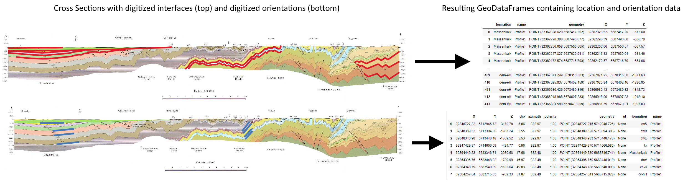
</a>
</td>

<td>
<a href="https://gemgis.readthedocs.io/en/latest/getting_started/tutorial/16_extracting_interfaces_from_geological_maps.html">
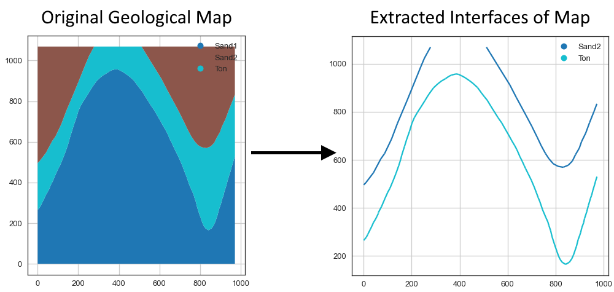
</a>
</td>

</tr>
</table>

<table>

<tr>
    <td><b style="font-size:30px">Creating Orientations from Isolines on maps</b></td>
    <td><b style="font-size:30px">Calculating Orientations from Strike Lines</b></td>
 </tr>
<tr>

<td>
<a href="https://gemgis.readthedocs.io/en/latest/getting_started/tutorial/25_creating_orientations_from_isolines_on_maps.html">
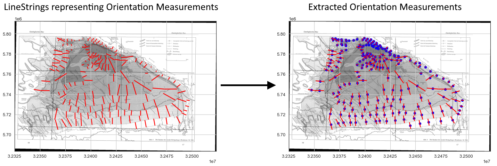
</a>
</td>

<td>
<a href="https://gemgis.readthedocs.io/en/latest/getting_started/tutorial/29_calculating_orientations_from_strike_lines.html">
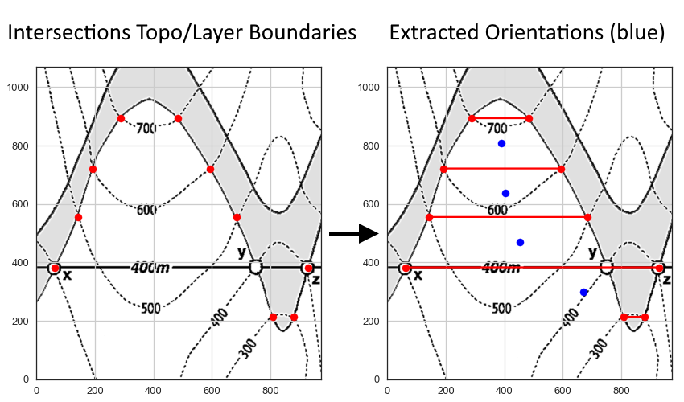
</a>
</td>

</tr>
</table>

### Working with Raster Data

<table>

<tr>
    <td><b style="font-size:30px">Sampling from Rasters</b></td>
    <td><b style="font-size:30px">Sampling Interfaces and Orientations from Rasters</b></td>
 </tr>
<tr>

<td>
<a href="https://gemgis.readthedocs.io/en/latest/getting_started/tutorial/06_sampling_from_rasters.html">
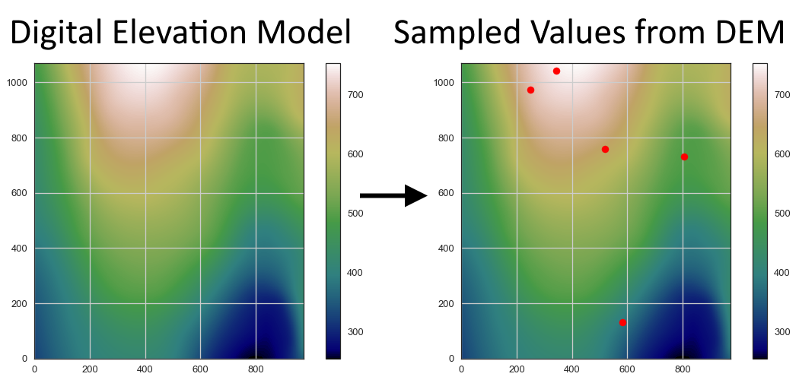
</a>
</td>

<td>
<a href="https://gemgis.readthedocs.io/en/latest/getting_started/tutorial/08_sampling_interfaces_orientations_from_rasters.html">
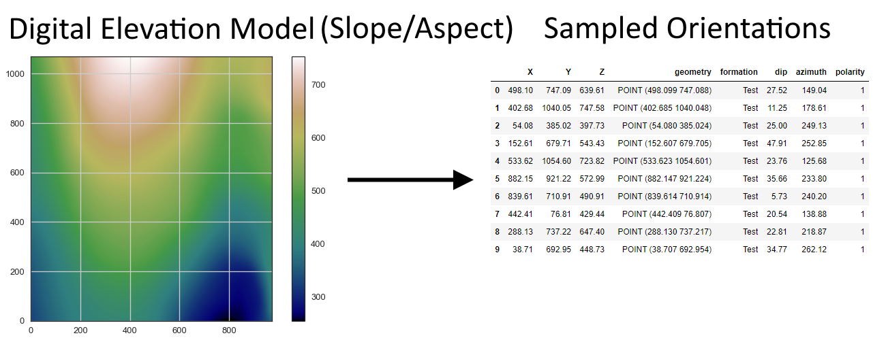
</a>
</td>

</tr>
</table>

<table>

<tr>
    <td><b style="font-size:30px">Calculating Raster Properties</b></td>
    <td><b style="font-size:30px">Additional Raster Operations in GemGIS</b></td>
 </tr>
<tr>

<td>
<a href="https://gemgis.readthedocs.io/en/latest/getting_started/tutorial/07_calculating_raster_properties.html">
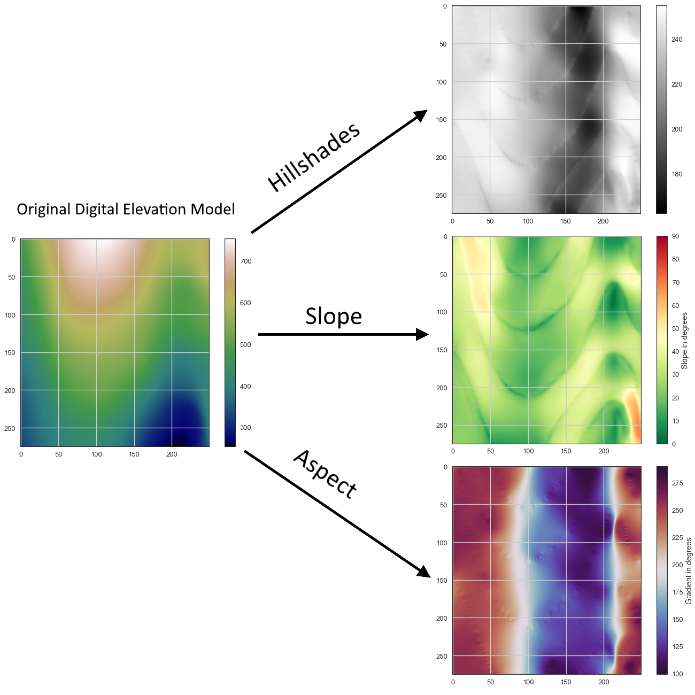
</a>
</td>

<td>
<a href="https://gemgis.readthedocs.io/en/latest/getting_started/tutorial/09_raster_operations_gemgis.html">
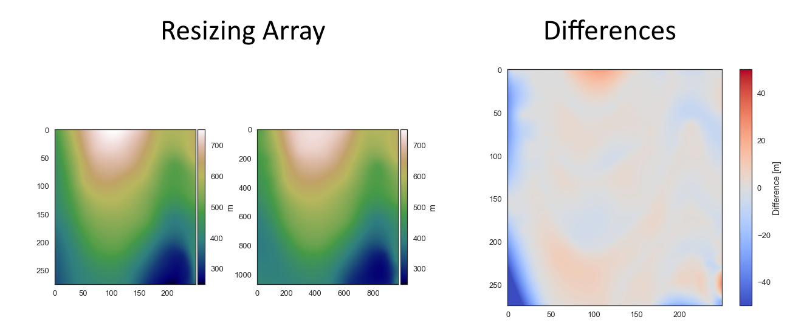
</a>
</td>

</tr>
</table>

### Working with PolyData and Grids/Meshes in PyVista

<table>

<tr>
    <td><b style="font-size:30px">Visualizing Spatial Data with PyVista</b></td>
    <td><b style="font-size:30px">Visualizing Topography and Maps with PyVista</b></td>
 </tr>
<tr>

<td>
<a href="https://gemgis.readthedocs.io/en/latest/getting_started/tutorial/10_visualizing_data_with_pyvista.html">
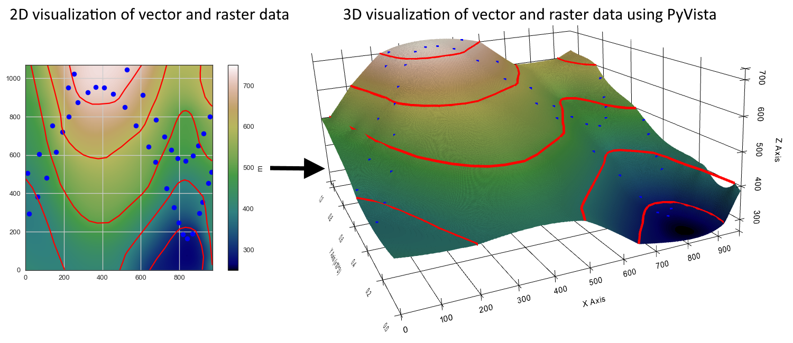
</a>
</td>

<td>
<a href="https://gemgis.readthedocs.io/en/latest/getting_started/tutorial/14_visualizing_topography_and_maps_with_pyvista.html">
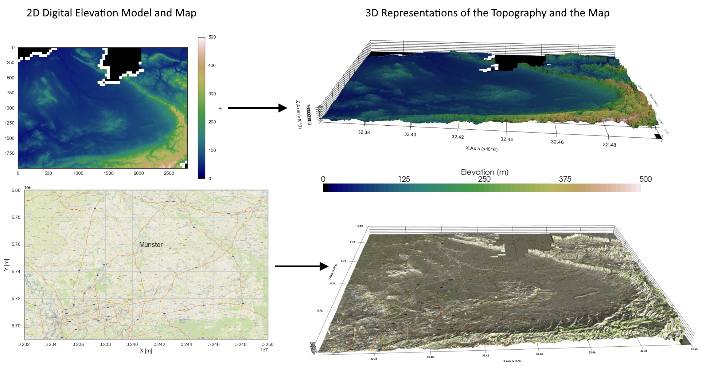
</a>
</td>

</tr>
</table>

<table>

<tr>
    <td><b style="font-size:30px">Visualizing Geological Cross Sections with PyVista</b></td>
    <td><b style="font-size:30px">Creating Depth Maps from GemPy Models</b></td>
 </tr>
<tr>

<td>
<a href="https://gemgis.readthedocs.io/en/latest/getting_started/tutorial/12_visualizing_cross_sections_in_pyvista.html">
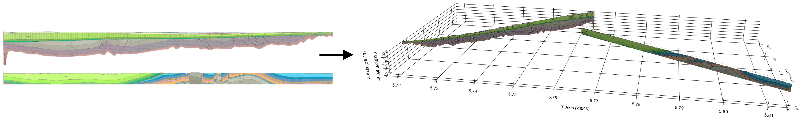
</a>
</td>

<td>
<a href="https://gemgis.readthedocs.io/en/latest/getting_started/tutorial/18_creating_depth_maps_from_gempy_models.html">
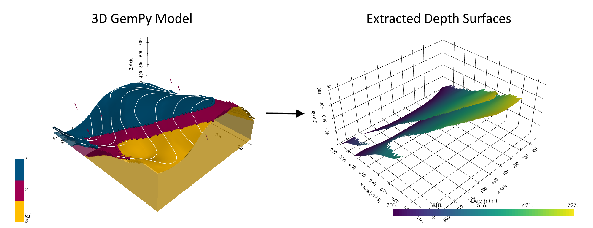
</a>
</td>

</tr>
</table>

<table>

<tr>
    <td><b style="font-size:30px">Creating Temperature Maps from GemPy Models</b></td>
    <td><b style="font-size:30px">Calculating Thickness Maps from GemPy Models</b></td>
 </tr>
<tr>

<td>
<a href="https://gemgis.readthedocs.io/en/latest/getting_started/tutorial/22_creating_temperature_maps_from_gempy_models.html">
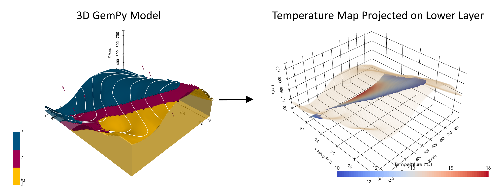
</a>
</td>

<td>
<a href="https://gemgis.readthedocs.io/en/latest/getting_started/tutorial/23_calculating_thickness_maps.html">
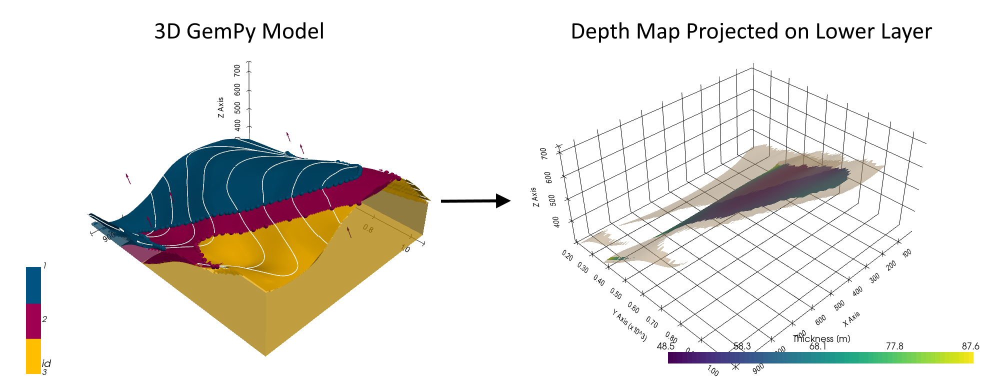
</a>
</td>

</tr>
</table>

### Working with Online Services

<table>

<tr>
    <td><b style="font-size:30px">Working with Web Map Services - WMS</b></td>
    <td><b style="font-size:30px">Working with Web Feature Services - WFS</b></td>
 </tr>
<tr>

<td>
<a href="https://gemgis.readthedocs.io/en/latest/getting_started/tutorial/19_working_with_web_map_services.html">
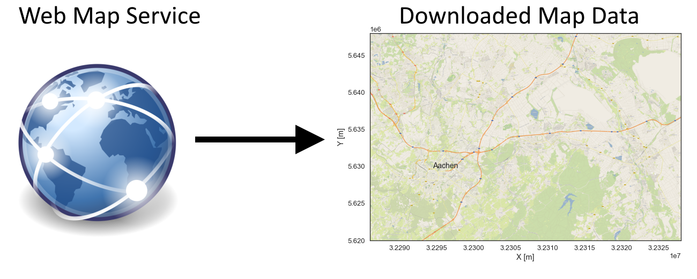
</a>
</td>

<td>
<a href="https://gemgis.readthedocs.io/en/latest/getting_started/tutorial/20_working_with_web_feature_services.html">
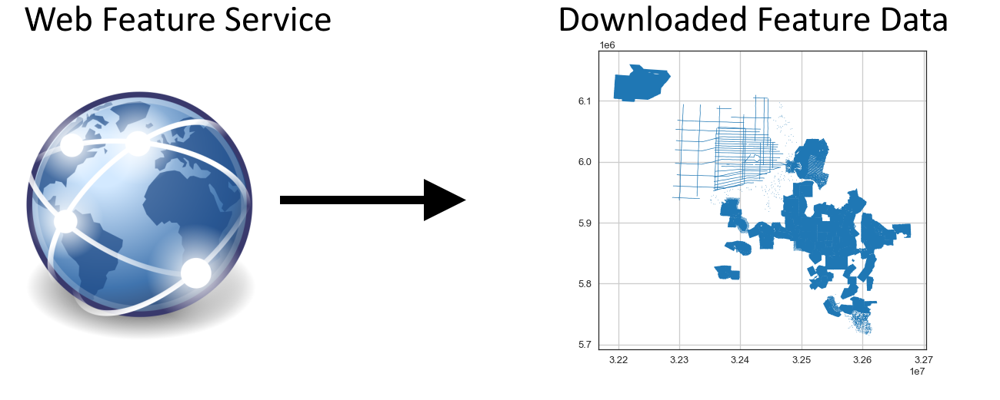
</a>
</td>

</tr>
</table>

<table>

<tr>
    <td><b style="font-size:30px">Working with Web Feature Services - WFS</b></td>
 </tr>
<tr>

<td>
<a href="https://gemgis.readthedocs.io/en/latest/getting_started/tutorial/21_working_with_web_coverage_services.html">
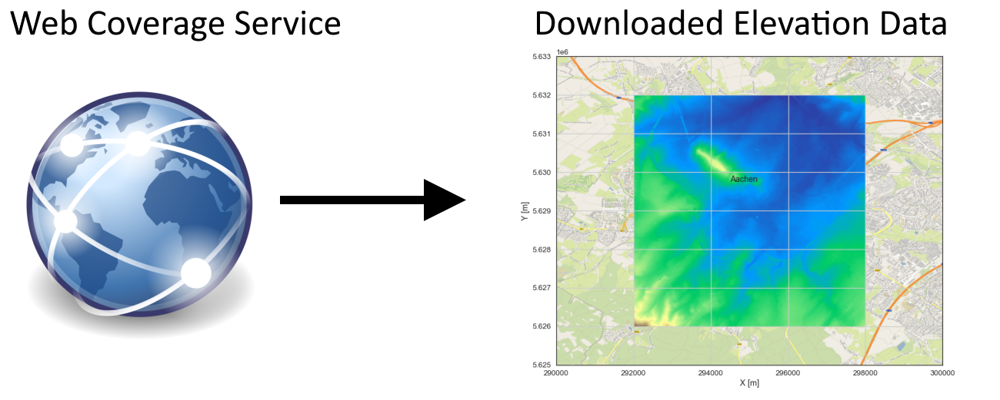
</a>
</td>

</tr>
</table>

### Parsing data formats

<table>

<tr>
    <td><b style="font-size:30px">Opening Leapfrog Meshes and GoCad TSurfaces</b></td>
    <td><b style="font-size:30px">Opening OBJ and DXF Files with PyVista in GemGIS</b></td>
 </tr>
<tr>

<td>
<a href="https://gemgis.readthedocs.io/en/latest/getting_started/tutorial/15_opening_leapfrog_meshes_and_gocad_tsurfaces.html">
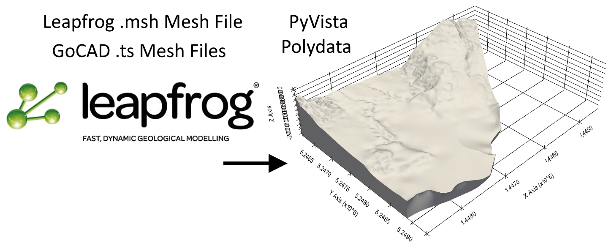
</a>
</td>

<td>
<a href="https://gemgis.readthedocs.io/en/latest/getting_started/tutorial/27_opening_obj_and_dxf_files.html">
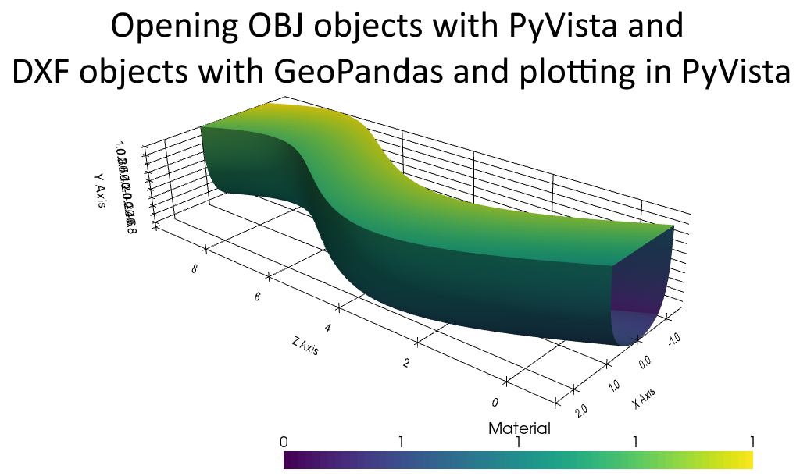
</a>
</td>

</tr>
</table>

<table>

<tr>
    <td><b style="font-size:30px">Opening GeoDataBases for GemGIS</b></td>
 </tr>
<tr>

<td>
<a href="https://gemgis.readthedocs.io/en/latest/getting_started/tutorial/30_opening_geodatabases_for_gemgis.html">
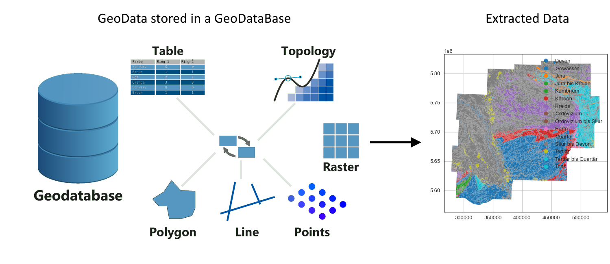
</a>
</td>

</tr>
</table>

### Additional Functionality

<table>

<tr>
    <td><b style="font-size:30px">Plotting Orientations with mplstereonet</b></td>
    <td><b style="font-size:30px">Plotting Hypocenters of Earthquakes with PyVista</b></td>
 </tr>
<tr>

<td>
<a href="https://gemgis.readthedocs.io/en/latest/getting_started/tutorial/17_plotting_orientations_with_mplstereonet.html">
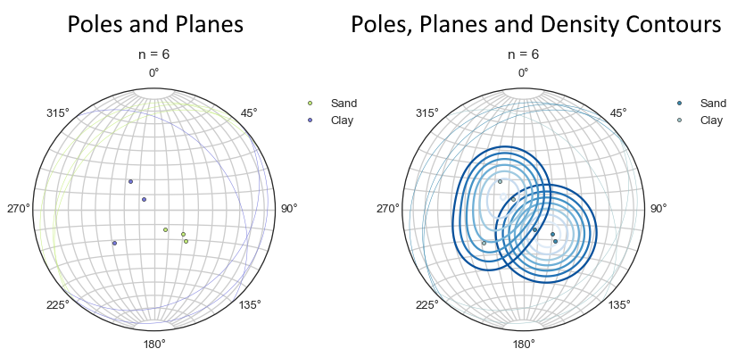
</a>
</td>

<td>
<a href="https://gemgis.readthedocs.io/en/latest/getting_started/tutorial/24_plotting_hypocenters_of_earthquakes.html">
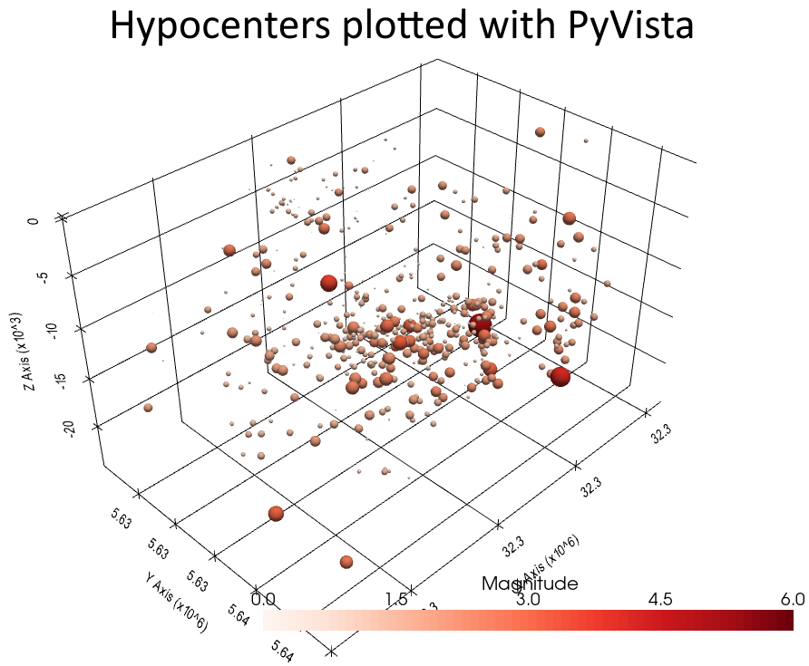
</a>
</td>

</tr>
</table>

#### Working with Well Data from the Geological Survey NRW

#### Parsing QGIS Style File to GemGIS

#### Obtaining City Locations

