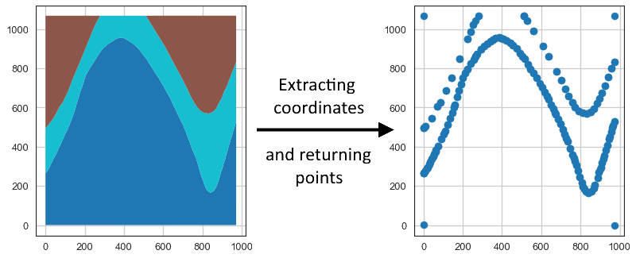
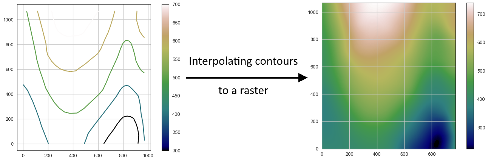
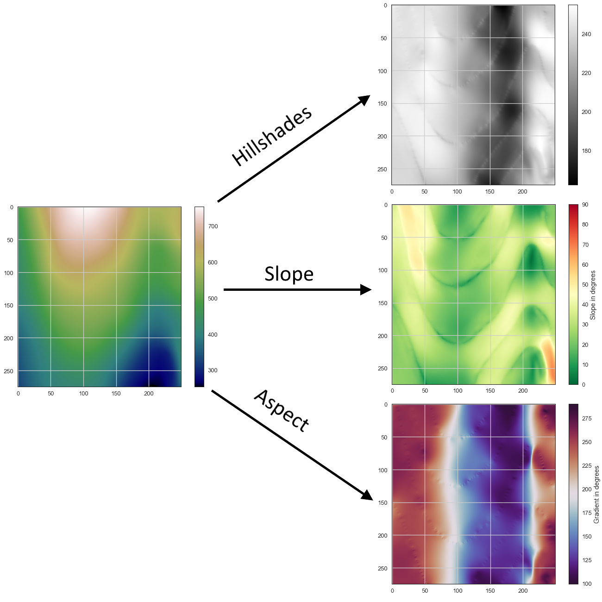

> Spatial data and information processing for geomodeling

## Overview 

We attempt to simplify the access to open-source spatial data processing for geological modeling with the development of **GemGIS, a Python-based open-source library**. 

GemGIS wraps and extends the functionality of packages known to the geo-community such as [GeoPandas](https://geopandas.org/), [rasterio](https://rasterio.readthedocs.io/en/latest/#), [OWSLib](https://geopython.github.io/OWSLib/), [Shapely](https://shapely.readthedocs.io/en/latest/manual.html), [PyGEOS](https://pygeos.readthedocs.io/en/latest/), [PyVista](https://docs.pyvista.org/), [Pandas](https://pandas.pydata.org/), [NumPy](https://numpy.org/) and the geomodelling package [GemPy](https://docs.gempy.org/). 

The aim of GemGIS, as indicated by the name, is to become a bridge between conventional geoinformation systems (GIS) such as ArcGIS and QGIS, and geomodelling tools such as GemPy, allowing simpler and more automated workflows from one environment to the other.

## Resources

[Find the documentation of GemGIS here](https://gemgis.readthedocs.io/en/latest/index.html). It includes introductions to the main used libraries and to topics like "What is vector data?" or "What is raster data?". 

In addition, [tutorial notebooks](https://gemgis.readthedocs.io/en/latest/getting_started/tutorial/index.html) provide an overview of the different features of GemGIS.

## Installation
It is recommended to use GemGIS with **python==3.9** in a separated environment. The main packages and its dependencies can be installed via the conda-forge channel. GemGIS is then available through PyPi. 
1) `conda install -c conda-forge pygeos`
2) `conda install -c conda-forge geopandas`
3) `conda install -c conda-forge rasterio`
4) `conda install -c conda-forge pyvista`
5) `pip install gemgis`

Check out the [Installation Page](https://gemgis.readthedocs.io/en/latest/getting_started/installation.html) for more detailed instructions. 

## References

* Jüstel, A., Endlein Correira, A., Wellmann, F. and Pischke, M.: GemGIS – GemPy Geographic: Open-Source Spatial Data Processing for Geological Modeling. EGU General Assembly 2021, https://doi.org/10.5194/egusphere-egu21-4613, 2021
* Jüstel, A.: 3D Probabilistic Modeling and Data Analysis of the Aachen-Weisweiler Area: Implications for Deep Geothermal Energy Exploration, unpublished Master Thesis at RWTH Aachen University, 2020
* de la Varga, M., Schaaf, A., and Wellmann, F.: GemPy 1.0: open-source stochastic geological modeling and inversion, Geosci. Model Dev., 12, 1-32, https://doi.org/10.5194/gmd-12-1-2019, 2019
* Powell, D.: Interpretation of Geological Structures Through Maps: An Introductory Practical Manual, Longman, pp. 192, 1992
* Bennison, G.M.: An Introduction to Geological Structures and Maps, Hodder Education Publication, pp. 78, 1990

## Gallery

### Working with Vector Data

<table>

<tr>
    <td><b style="font-size:30px">Extracting XY values from Vector Data</b></td>
    <td><b style="font-size:30px">Extracting XYZ values from Vector Data</b></td>
 </tr>
<tr>
<tr>

<td>

</td>

<td>

</td>

</tr>
</table>

  

<table>

<tr>
    <td><b style="font-size:30px">Exploding Geometries/Vector Data</b></td>
    <td><b style="font-size:30px">Clipping/Cropping Vector Data</b></td>
 </tr>
<tr>

<td>

</td>

<td>

</td>
</tr>
</table>

<table>

<tr>
    <td><b style="font-size:30px">Interpolating Vector Data to Rasters</b></td>
    <td><b style="font-size:30px">Removing Interface Points within Fault Buffers</b></td>
 </tr>
<tr>

<td>

</td>

<td>

</td>

</tr>
</table>

<table>

<tr>
    <td><b style="font-size:30px">Extracting Interface Points and Orientations from Geological Cross Sections</b></td>
    <td><b style="font-size:30px">Extracting Interface Points from Geological Maps</b></td>
 </tr>
<tr>

<td>

</td>

<td>

</td>

</tr>
</table>

<table>

<tr>
    <td><b style="font-size:30px">Creating Orientations from Isolines on maps</b></td>
    <td><b style="font-size:30px">Calculating Orientations from Strike Lines</b></td>
 </tr>
<tr>

<td>

</td>

<td>

</td>

</tr>
</table>

### Working with Raster Data

<table>

<tr>
    <td><b style="font-size:30px">Sampling from Rasters</b></td>
    <td><b style="font-size:30px">Sampling Interfaces and Orientations from Rasters</b></td>
 </tr>
<tr>

<td>

</td>

<td>

</td>

</tr>
</table>

<table>

<tr>
    <td><b style="font-size:30px">Calculating Raster Properties</b></td>
    <td><b style="font-size:30px">Additional Raster Operations in GemGIS</b></td>
 </tr>
<tr>

<td>

</td>

<td>

</td>

</tr>
</table>

### Working with PolyData and Grids/Meshes in PyVista

#### Visualizing Spatial Data with PyVista

#### Visualizing Geological Cross Sections with PyVista

#### Visualizing Topography and Maps with PyVista

#### Creating Depth Maps from GemPy Models

#### Creating Temperature Maps from GemPy Models

#### Calculating Thickness Maps from GemPy Models

### Working with Online Services

#### Working with Web Map Services - WMS

#### Working with Web Feature Services - WFS

#### Working with Web Coverage Services - WCS

### Parsing data formats

#### Opening Leapfrog Meshes and GoCad TSurfaces

#### Opening OBJ and DXF Files with PyVista in GemGIS

#### Opening GeoDataBases for GemGIS

### Other

#### Plotting Orientations with mplstereonet

#### Plotting Hypocenters of Earthquakes with PyVista

#### Working with Well Data from the Geological Survey NRW

#### Parsing QGIS Style File to GemGIS

#### Obtaining City Locations

