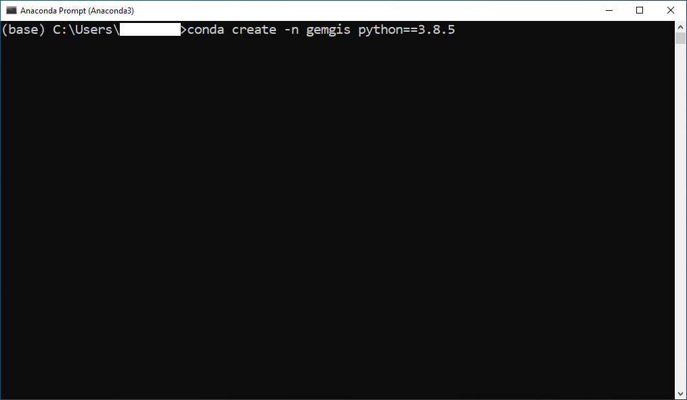
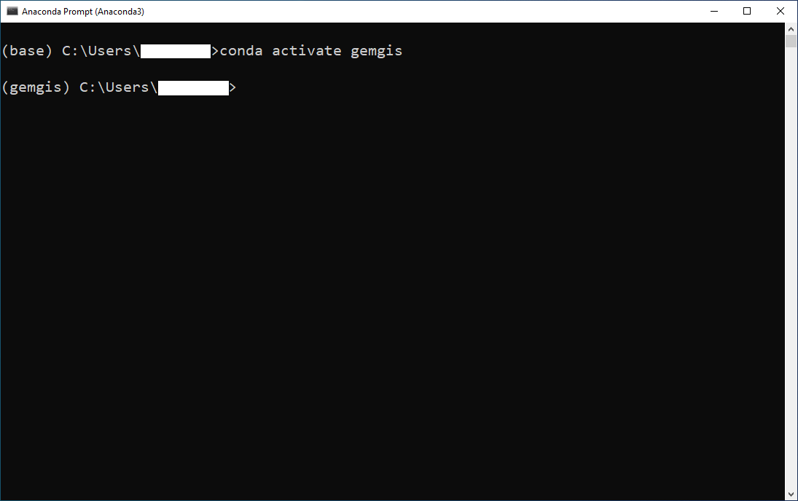
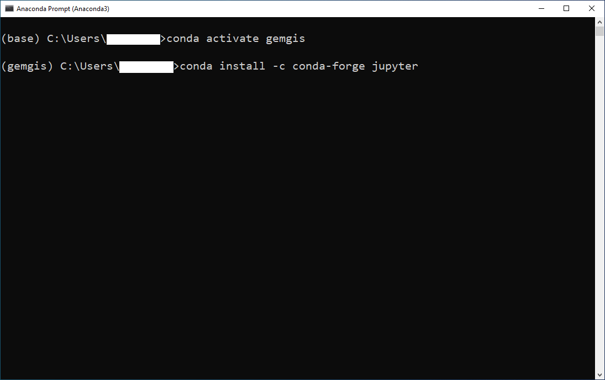
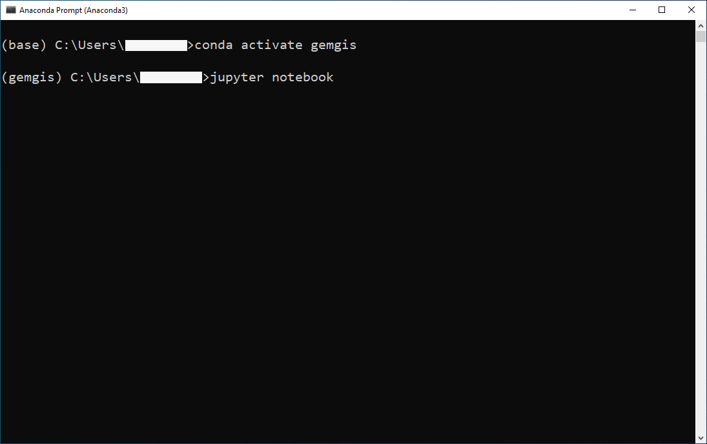
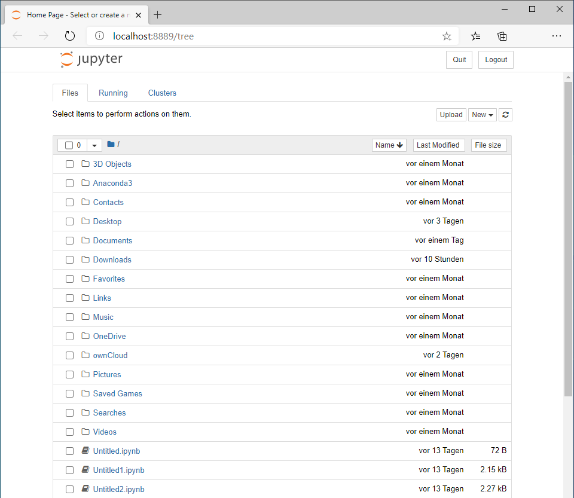
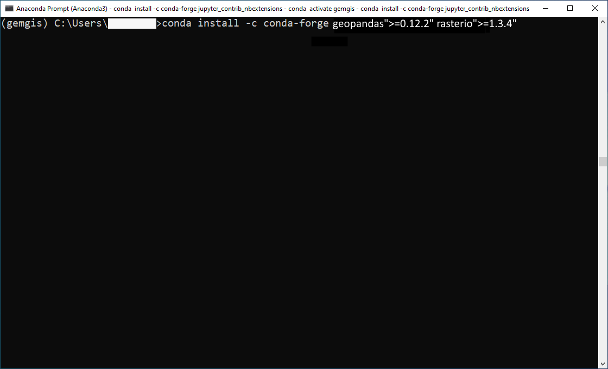
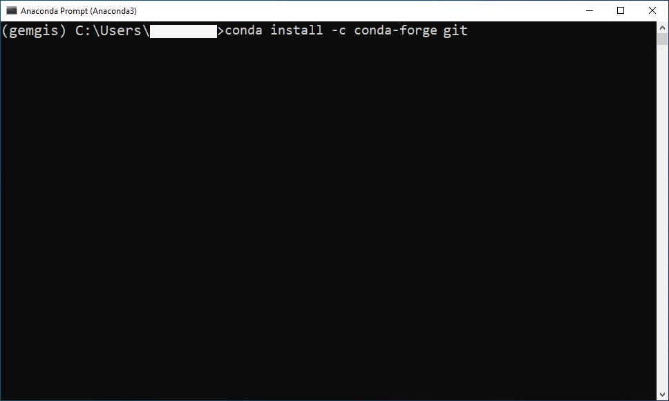
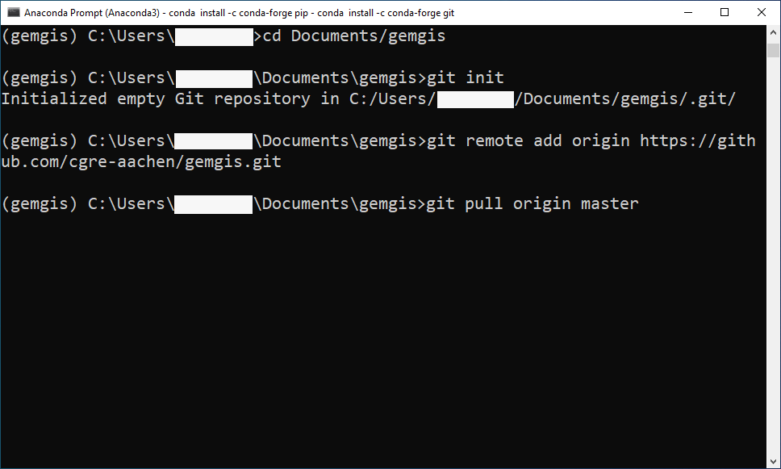
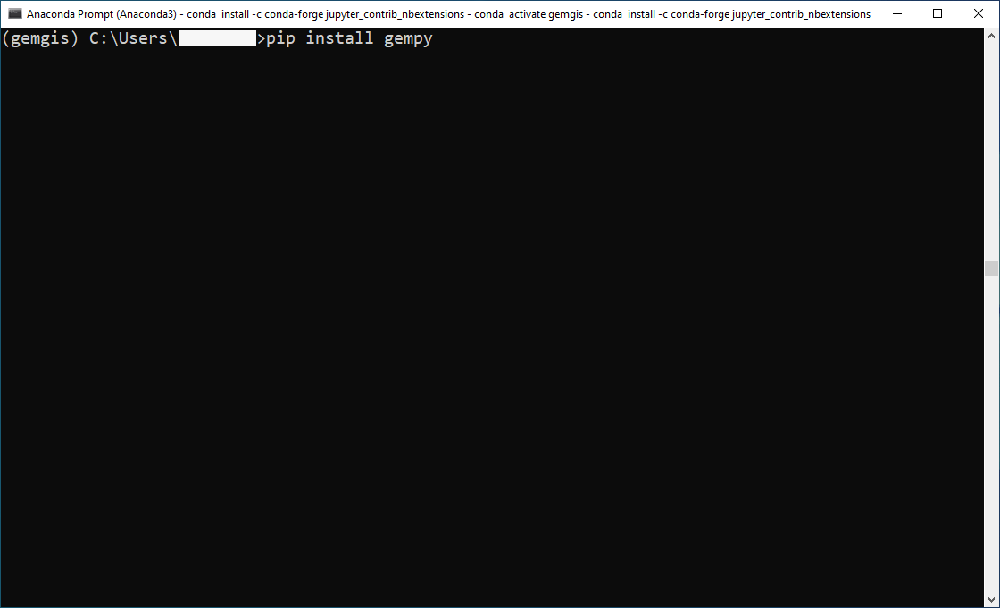
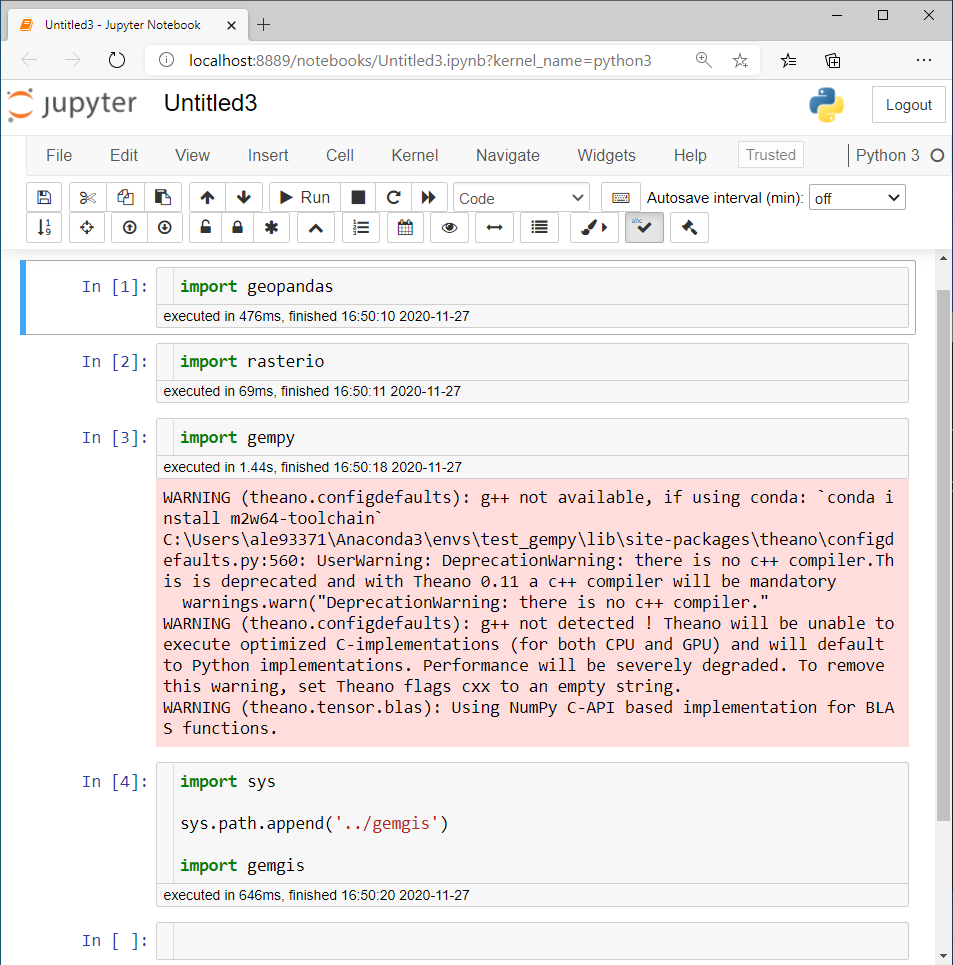

.. _installation_ref:

Installation (Tested 2023-01-01)
===========================================================

GemGIS is supported on Python version 3.10. Previous versions are officially not supported.

It is recommended to consider using Anaconda as a virtual environment and package manager for Python. The following installation instructions work with Anaconda.

.. image:: images/Anaconda_Logo.png

Installing Anaconda
~~~~~~~~~~~~~~~~~~~

The latest Anaconda distribution can be installed from `the Anaconda Website <https://www.anaconda.com/products/individual>`_.

The latest Anaconda cheat sheet can be downloaded from `the Anaconda Documentation <https://docs.conda.io/projects/conda/en/latest/_downloads/843d9e0198f2a193a3484886fa28163c/conda-cheatsheet.pdf>`_.

Creating virtual Environment
~~~~~~~~~~~~~~~~~~~~~~~~~~~~

It is recommended to create a new virtual environment when using GemGIS to avoid conflicts with already existing projects. This step and all following steps will be performed within the ``Anaconda Prompt (Anaconda3)``.

Creating a new environment in Anaconda with fixed Python version::

   conda create -n gemgis python==3.10

Click ``y`` if you are asked to proceed.

Activate virtual Environment
~~~~~~~~~~~~~~~~~~~~~~~~~~~~

Activate the virtual environment::

   conda activate gemgis

The gemgis environment now replaced the base environment which is indicated by ``gemgis`` in front of your path.

Setting channel priorities to avoid installation errors
~~~~~~~~~~~~~~~~~~~~~~~~~~~~~~~~~~~~~~~~~~~~~~~~~~~~~~~

As the installation of GeoPandas may result in an ``OSError``, it is recommended to set the channel priorities when installing packages from conda.

Known error::

    OSError: could not find or load spatialindex_c-64.dll

Solution::

    conda config --env --add channels conda-forge
    conda config --env --set channel_priority strict

After configuring the channels, you can proceed with the installation of the packages and dependencies.

Installing Packages and Dependencies
~~~~~~~~~~~~~~~~~~~~~~~~~~~~~~~~~~~~

Several packages need to be installed in order to use GemGIS. It is recommended to use ``Jupyter Notebooks`` when working with GemGIS. Packages are installed using the ``conda-forge`` channel.

Install Jupyter Notebooks::

   conda install -c conda-forge jupyter

You can start a new kernel by executing ``jupyter notebook`` in your Anaconda Prompt. A new kernel will then open in your browser.

The ``jupyter_contrib_nbextensions`` package contains a collection of community-contributed unofficial extensions that add useful functionality to the Jupyter notebook::

    conda install -c conda-forge jupyter_contrib_nbextensions

After installing the package, close and reopen your Anaconda prompt, activate your environment and open ``jupyter notebook``. The Jupyter Notebook extensions are not needed in order to use GemGIS but add the additional functionalities to your notebooks.

Installing GemGIS via conda-forge
~~~~~~~~~~~~~~~~~~~~~~~~~~~~~~~~~

GemGIS and all its dependencies can be installed via conda-forge::

    conda install -c conda-forge gemgis

Installing GemGIS's dependencies manually
~~~~~~~~~~~~~~~~~~~~~~~~~~~~~~~~~~~~~~~~~

Two of the main packages that GemGIS is dependent on are `rasterio <https://rasterio.readthedocs.io/en/latest/>`_ and `GeoPandas <https://geopandas.org/>`_. It is recommended to install these packages separately as they both depend on the `GDAL <https://gdal.org/>`_ translator library for raster and vector geospatial data. In addition, many smaller libraries like shaply or fiona will also be installed properly.

Install the latest versions of GeoPandas and Rasterio (as of 2023-01-01). Please mind the quotation marks that are necessary when specifying the version numbers.::

   conda install -c conda-forge geopandas">=0.12.2" rasterio">=1.3.4"

In order to visualize and work with meshes, the `PyVista <https://docs.pyvista.org/>`_ package is being installed::

    conda install -c conda-forge pyvista">=0.37.0"

Installing GemGIS via PyPi
~~~~~~~~~~~~~~~~~~~~~~~~~~

The latest stable version of GemGIS can be downloaded from `PyPi <https://pypi.org/project/gemgis/>`_::

   pip install gemgis

Installing GemGIS from the Repository
~~~~~~~~~~~~~~~~~~~~~~~~~~~~~~~~~~~~~

Alternatively, GemGIS can also be cloned from the `GemGIS Github repository <https://github.com/cgre-aachen/gemgis/tree/main/.github>`_. You can either download the package from the repository or download it with ``git``. Git can either be installed in the current conda environment or by downloading a third party programme like `Git Bash <https://git-scm.com/downloads>`_.

Installing git in the current conda environment::

   conda install -c conda-forge git

A folder where GemGIS is being stored needs to be selected when cloning/installing GemGIS from the Github repository. When opening the Anaconda Prompt the first time, the default path should be within the folder of the current user. Create an empty folder with your file explorer at a destination where you want to save GemGIS. In this case, GemGIS will be stored in a folder called ``gemgis`` within the ``Documents`` folder.

Navigate to the GemGIS folder::

   cd Documents/gemgis

Use the following command to go up one level in your folder structure::

   cd ..

Now, a new git repository needs to be initiated within the gemgis folder::

   git init

Linking the remote repository to the local repository::

   git remote add origin https://github.com/cgre-aachen/gemgis.git

Download the latest version of GemGIS from the main branch::

   git pull origin main

You should now have the latest GemGIS files in your gemgis folder.

Installing GemPy (Optional)
~~~~~~~~~~~~~~~~~~~~~~~~~~~

The current modeling package that is supported by GemGIS is `GemPy <https://docs.gempy.org/>`_. GemPy can easily be installed with ``pip``/PyPi::

   pip install gempy

Checking the Installation
~~~~~~~~~~~~~~~~~~~~~~~~~

Before starting to work with GemGIS, it is recommended to check that all packages have been installed successfully.

* Open a new Anaconda prompt
* Activate your gemgis environment: ``conda activate gemgis``
* Start a new Jupyter kernel: ``jupyter notebook``
* Either navigate to one of the provided notebooks that come with GemGIS if you cloned the repository or create a new notebook
* In the notebook, run ``import rasterio``
* Run ``import geopandas as gpd``
* Run ``import gempy as gp``
* Run ``import gemgis as gg`` if you installed it via pip
* If you cloned the repository, you have to ``import sys``, append the path to the local repository using ``sys.path.append('..your/path/to/the/repo/gemgis')`` before ``import gemgis as gg``
* Install missing dependencies via the Anaconda Prompt using ``pip install package name``.

