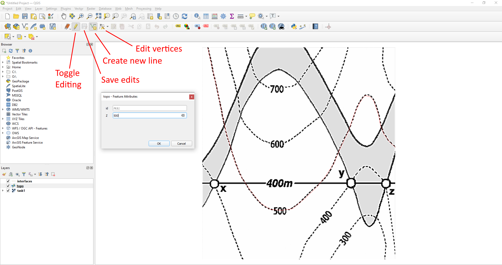

.. _data_generation_ref:

00 Generating Data in QGIS for GemGIS
=====================================

Much of the data that is used in ``GemGIS`` may already be available as vector or raster data. This data is then usually visualized in a GIS system, a geoinformation system. GIS systems can be used to create, edit, organize, analyse or present spatial data. Two of the most common GIS systems used in Earth Sciences are the open-source package `QGIS <https://qgis.org/en/site/>`_ and the commercial software `ArcGIS <https://www.arcgis.com/index.html>`_. It is highly recommended to download and install QGIS if you do not have a ArcGIS license at hand.

Downloading and Installing QGIS
~~~~~~~~~~~~~~~~~~~~~~~~~~~~~~~

QGIS can be downloaded from `here <https://qgis.org/en/site/forusers/download.html>`_. Once downloaded follow the installation instructions on your screen.

Creating a new Project in QGIS
~~~~~~~~~~~~~~~~~~~~~~~~~~~~~~

Create a new project in QGIS by opening the software and clicking ``New Project`` (CTRL-N).

Installing the Georeferencing Tool
~~~~~~~~~~~~~~~~~~~~~~~~~~~~~~~~~~

In order to work with real data and real coordinates, we need to tell QGIS at what position our data is located. Many dataset are already georeferenced, meaning that each point or set of data can be attributed real world coordinates. In order to be able to tell QGIS where the data is located for instance on a map, this map needs to be georeferenced. An extensive guide on how to georeference a raster can be found `here <https://docs.qgis.org/2.8/en/docs/user_manual/plugins/plugins_georeferencer.html>`_. In your menu bar, click on ``Plugins`` -> ``Manage and Install Plugins`` and search for ``Georeferencer``. Once you have found it, install it.

Georeferencing a raster
~~~~~~~~~~~~~~~~~~~~~~~

Open the georeferencing tool by clicking on ``Raster`` -> ``Georeferencer``. A new blank window will open. Click the ``Open Raster`` button to add a new raster. Click on the gear to change the ``Transformation Settings". Click on ``Add Point`` to add ground control points (GCP). Click on ``Start Georeferencing`` once enough GCPs were set and the transformation settings have been set.

Adding Ground Control Points
~~~~~~~~~~~~~~~~~~~~~~~~~~~~

Add ground control points by clicking ``Add Point`` you can then click on any position on the raster. A window will open which asks you to provide the coordinates of this point. Have these coordinates ready for the georeferencing. In this case, we assume that the lower left corner is the origin (0,0) and that the image has a 1 m resultion with 972 m in W-E direction and 1069 m in N-S direction. Three points have already been added to the table. The fourth one, the upper right corner, will be added as last point before setting the Transformation Settings.

Adjusting Transformation Settings
~~~~~~~~~~~~~~~~~~~~~~~~~~~~~~~~~

Click the gear to adjust the transformation settings. You can adjust the ``Transformation Parameters`` by setting the ``Transformation Type``, the ``Resampling Method`` and the ``Target CRS`` (Coordinate Reference System). You can also check the box to load the the georeferenced map directly into QGIS. Click ``Okay`` when all settings have been adjusted.

Start Georeferencing
~~~~~~~~~~~~~~~~~~~~

Click the green arrow ``Start Georeferencing`` to start the georeferencing process. If the box to load the raster into QGIS once the georeferencing was successful was checked, the raster will appear in the project window and can be used for further tasks.

Creating a new Shapefile in QGIS
~~~~~~~~~~~~~~~~~~~~~~~~~~~~~~~~

Create a new shape file by clicking ``Layer`` -> ``Create Layer`` -> ``New Shapefile Layer`` in the menu bar. You can select the ``File Name``, the ``Geometry Type``, the coordinate reference system and add new fields to the shape file within the opened dialog. You can choose between ``Points``, ``MultiPoints``, ``Lines`` and ``Polygons`` as geometry type. Fields containing strings or numbers can be added to the shape file. Once created, the shape file will appear in your layer overview.

Digitizing Data in QGIS
~~~~~~~~~~~~~~~~~~~~~~~

Once you have created a layer, ``Toggle Editing`` to start digitizing your data. Click ``Add Line Feature`` to add a line. You conclude the line by doing a right click. The `Features Attribute`` window will open to enter additional attribute data. Do not forget to save your work! ``Toggle Editing`` again to stop editing your layer.

