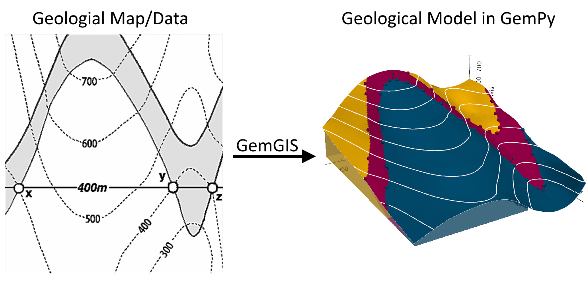

.. _tutorials_ref:

Tutorials and Basic Usage
===========================================================

There is a series of tutorials available for GemGIS. In order to keep the size of the main GemGIS package as small as possible, the data is provided through a separated repository `gemgis-data <https://github.com/cgre-aachen/gemgis_data/tree/main>`_. You can also download the data directly following `this link <https://github.com/cgre-aachen/gemgis_data/archive/main.zip>`_.

Watch our Video Tutorials: *link to be provided soon*

The following subsections elaborate on the basic API usage of GemGIS. This includes the extraction of information from input data files, the creation of new data and the preparation of data for the geomodeling with ``GemPy``. The respective reading or loading functions of packages such as ``GeoPandas`` or ``rasterio`` will be used to load the data as ``GeoDataFrame`` or rasterio object.

The aim of this and the upcoming tutorials is to demonstrate how to prepare spatial data for geomodeling with `GemPy` to get a geological model. Raw data is usually created/digitized within QGIS which we encourage the user to use!

Each set of functions of GemGIS is collected in a different module. The functions of each module can be accessed as followed:

.. code-block:: python

   import gemgis as gg

   data = gg.vector.function_name(...)

   data = gg.raster.function_name(...)

   data = gg.visualization.function_name(...)

   data = gg.web.function_name(...)

   data = gg.utils.function_name(...)

   data = gg.misc.functions_name(...)

.. toctree::
    :maxdepth: 1
    :caption: Tutorials

    00_generating_data_qgis
    01_extract_xy
    02_extract_xyz
    03_exploding_geometries
    04_clipping_data
    05_interpolating_rasters
    06_sampling_from_rasters
    07_calculating_raster_properties
    08_sampling_interfaces_orientations_from_rasters
    09_raster_operations_gemgis
    10_visualizing_data_with_pyvista
    11_removing_interfaces_within_fault_buffers
    12_visualizing_cross_sections_in_pyvista
    13_extracting_interfaces_orientations_from_cross_sections
    14_visualizing_topography_and_maps_with_pyvista
    15_opening_leapfrog_meshes_and_gocad_tsurfaces
    16_extracting_interfaces_from_geological_maps
    17_plotting_orientations_with_mplstereonet
    18_creating_depth_maps_from_gempy_models
    19_working_with_web_map_services
    20_working_with_web_feature_services
    21_working_with_web_coverage_services
    22_creating_temperature_maps_from_gempy_models
    23_calculating_thickness_maps
    24_plotting_hypocenters_of_earthquakes
    25_creating_orientations_from_isolines_on_maps
    26_working_with_well_data_from_GD_NRW
    27_opening_obj_and_dxf_files
    28_parsing_QGIS_style_files
    29_calculating_orientations_from_strike_lines
    30_opening_geodatabases_for_gemgis
    31_obtaining_location_information
    32_using_ipyvtk_with_pyvista_for_visualization
    33_slicing_geological_models_with_pyvista
    34_interpolating_strike_lines_with_gemgis
    35_plotting_borehole_data_with_pyvista
    36_creating_proj_crs_objects_for_gemgis
    37_delaunay_triangulation_for_isoline_maps
    38_interactive_plotting_with_bokeh_ingemgis
    39_shapely_base_geometries_with_z_component
    40_working_with_gpx_data_in_gemgis
    41_working_with_kml_data
    42_draping_linestrings_over_dem_in_pyvista
    43_create_linestrings_from_pyvista_contours
    44_fitting_plane_through_earthquake_hypocenters
    45_opening_asc_and_zmap_grids
    46_working_with_hgt_files_in_gemgis
    47_delaunay_triangulation_of_shapely_multipoints
    48_georeferencing_rasters_using_rasterio
    49_slicing_gempy_lith_blocks_in_pyvista_with_gemgis
    50_parsing_leapfrog_wells
    51_assigning_physical_properties_to_lith_block
    52_digitizing_data_from_pyvista_meshes
    53_adding_anthropogenic_geometries_to_pyvista