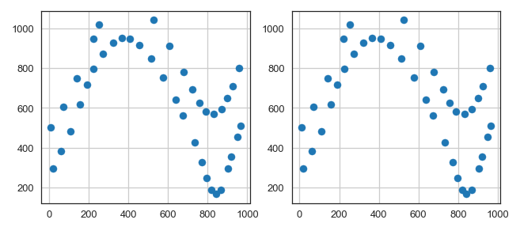
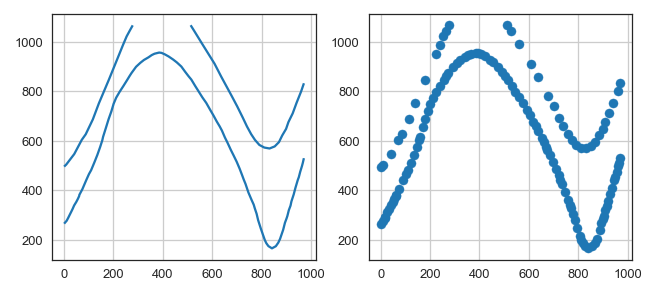
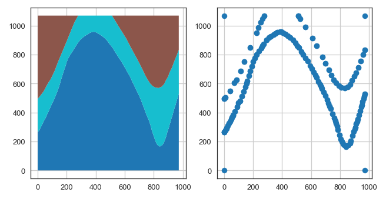

.. _tutorials_ref:

Tutorials and Basic API Usage
===========================================================

There is a series of tutorials available for GemGIS. In order to keep the size of the main GemGIS package as small as possible, the data is provided through a separated repository `gemgis-data <https://github.com/cgre-aachen/gemgis_data/tree/master>`_. You can also download the data directly following `this link <https://github.com/cgre-aachen/gemgis_data/archive/master.zip>`_.

Watch our Video Tutorials: *link to be provided soon*

The following subsections elaborate on the basic API usage of GemGIS. This includes the extraction of information from input data files, the creation of new data and the preparation of data for the geomodeling with ``GemPy``. The respective reading or loading functions of packages such as ``GeoPandas`` or ``rasterio`` will be used to load the data as ``GeoDataFrame`` or rasterio object.

01 Extract XY Coordinates
_________________________

Vector data is commonly provided as ``shape`` files. These files can be loaded with ``GeoPandas`` as ``GeoDataFrames``. Each geometry object is stored as ``shapely`` object within the ``GeoSeries`` ``geometry`` of the ``GeoDataFrames``. The basic ``shapely`` objects used here are:

* Points/Multi-Points
* Lines/Multi-Lines
* Polygons/Multi-Polygons

The first step is to load the data using ``GeoPandas``. We can inspect the different columns of the GeoDataFrame by looking at its head. In the following examples for point, line and polygon data, we have an ``id`` column which was created during the digitalizing of the data in QGIS, a formation column containing the name of a geological unit (this becomes important later for the actual modeling) and most importantly the geometry column consisting of the ``shapely`` geometry objects. The X and Y coordinates of the different geometry objects can then be extracted using ``extract_xy()`` of the GemGIS vector module.

Point Data
~~~~~~~~~~

.. code-block:: python

    import geopandas as gpd
    import gemgis as gg

    gdf = gpd.read_file('vector_data.shp')

    gdf.head()

= ==== ========= =======================
0 id   formation geometry
= ==== ========= =======================
0 None Sand      POINT (19.150 293.313)
1 None Sand      POINT (61.934 381.459)
2 None Sand      POINT (109.358 480.946)
3 None Sand      POINT (157.812 615.999)
4 None Sand      POINT (191.318 719.094)
= ==== ========= =======================

The resulting GeoDataFrame has now an additional ``X`` and ``Y`` column containing the coordinates of the point objects. These can now be easily used for further processing. The geometry types of the shapely objects remained unchanged. The ``id`` column was dropped by default.

.. code-block:: python

    gdf_xy = gg.vector.extract_xy(gdf=gdf)

    gdf_xy.head()

= ========= ======================= ====== ======
0 formation geometry                X      Y
= ========= ======================= ====== ======
0 Sand      POINT (19.150 293.313)  19.15  293.31
1 Sand      POINT (61.934 381.459)  61.93  381.46
2 Sand      POINT (109.358 480.946) 109.36 480.95
3 Sand      POINT (157.812 615.999) 157.81 616.00
4 Sand      POINT (191.318 719.094) 191.32 719.09
= ========= ======================= ====== ======

.. code-block:: python

    from matplotlib import pyplot

    fig, (ax1,ax2) = plt.subplots(1,2)

    gdf.plot(ax=ax1, aspect='equal')
    ax1.grid()

    gdf_xy.plot(ax=ax2, aspect='equal')
    ax2.grid()

Line Data
~~~~~~~~~
.. code-block:: python

    import geopandas as gpd
    import gemgis as gg

    gdf = gpd.read_file('vector_data.shp')

    gdf.head()

= ==== ========= =================================================
0 id   formation geometry
= ==== ========= =================================================
0 None Sand      LINESTRING (0.256 264.862, 10.593 276.734, 17....
1 None Sand      LINESTRING (0.188 495.787, 8.841 504.142, 41.0...
2 None Sand      LINESTRING (970.677 833.053, 959.372 800.023, ...
= ==== ========= =================================================

The resulting GeoDataFrame has now an additional ``X`` and ``Y`` column. These values represent the single vertices of each LineString. The geometry types of the shapely objects in the GeoDataFrame were converted from LineStrings to Points to match the X and Y column data. The ``id`` column was dropped by default. The index of the new GeoDataFrame was reset.

.. code-block:: python

    gdf_xy = gg.vector.extract_xy(gdf=gdf)

    gdf_xy.head()

= ========= ======================= ====== ======
0 formation geometry                X      Y
= ========= ======================= ====== ======
0 Sand      POINT (0.256 264.862)   0.26   264.86
1 Sand      POINT (10.593 276.734)  10.59  276.73
2 Sand      POINT (17.135 289.090)  17.13  289.09
3 Sand      POINT (19.150 293.313)  19.15  293.31
4 Sand      POINT (27.795 310.572)  27.80  310.57
= ========= ======================= ====== ======

.. code-block:: python

    from matplotlib import pyplot

    fig, (ax1,ax2) = plt.subplots(1,2)

    gdf.plot(ax=ax1, aspect='equal')
    ax1.grid()

    gdf_xy.plot(ax=ax2, aspect='equal')
    ax2.grid()

Polygon Data
~~~~~~~~~~~~
.. code-block:: python

    import geopandas as gpd
    import gemgis as gg

    gdf = gpd.read_file('vector_data.shp')

    gdf.head()

= ==== ========= =================================================
0 id   formation geometry
= ==== ========= =================================================
0 None Sand      POLYGON ((0.256 264.862, 10.593 276.734, 17.13...
1 None Sand      POLYGON ((0.256 264.862, 0.188 495.787, 8.841 ...
2 None Sand      POLYGON ((0.188 495.787, 0.249 1068.760, 278.5...
3 None Sand      POLYGON ((511.675 1068.852, 971.698 1068.800, ...
= ==== ========= =================================================

The resulting GeoDataFrame has now an additional ``X`` and ``Y`` column. These values represent the single vertices of each Polygon. The geometry types of the shapely objects in the GeoDataFrame were converted from Polygons to Points to match the X and Y column data. The ``id`` column was dropped by default. The index of the new GeoDataFrame was reset.

.. code-block:: python

    gdf_xy = gg.vector.extract_xy(gdf=gdf)

    gdf_xy.head()

= ========= ======================= ====== ======
0 formation geometry                X      Y
= ========= ======================= ====== ======
0 Sand      POINT (0.256 264.862)   0.26   264.86
1 Sand      POINT (10.593 276.734)  10.59  276.73
2 Sand      POINT (17.135 289.090)  17.13  289.09
3 Sand      POINT (19.150 293.313)  19.15  293.31
4 Sand      POINT (27.795 310.572)  27.80  310.57
= ========= ======================= ====== ======

.. code-block:: python

    from matplotlib import pyplot

    fig, (ax1,ax2) = plt.subplots(1,2)

    gdf.plot(ax=ax1, column='formation', aspect='equal')
    ax1.grid()

    gdf_xy.plot(ax=ax2, aspect='equal')
    ax2.grid()

Additional Arguments
~~~~~~~~~~~~~~~~~~~~

Several additional arguments can be passed to adapt the functionality of the function. For further reference, see the `API Reference for extract_xy <file:///C:/Users/ale93371/Documents/gemgis/docs/_build/html/api_reference/vector_data.html#gemgis.vector.extract_xy>`_.

* reset_index (bool)
* drop_level0 (bool)
* drop_level1 (bool)
* drop_index (bool)
* drop_points (bool)
* overwrite_xy (bool)
* target_crs(str, pyproj.crs.crs.CRS)
* bbox (list)

Remarks
~~~~~~~

The function ``extract_xy()`` is a combination of the functions ``extract_xy_points()`` and ``extract_xy_linestrings()``. In addition, the functions ``explode_polygons()`` and ``explode_multilinestrings()`` are used to convert Polygons into single LineStrings for further coordinate extraction. Please see the the API Reference for :ref:`vector_data_ref` for further information.

02 Extract XYZ Coordinates
__________________________

The elevation or depth of input data is needed locate it in a 3D space. The data can either be provided when creating the data, i.e. when digitizing contour lines or by extracting it from a digital elevation model (DEM) or from an existing surface of an interface in the subsurface. For consistency, the elevation column will be denoted with ``Z``. The input vector data can be loaded again as ``GeoDataFrame`` using ``GeoPandas``. The raster from which elevation data will be extracted can either be provided as ``NumPy`` ``ndarray`` or opened with ``rasterio`` if a raster file is available on your hard disk.

.. code-block:: python

    gdf_xy = gg.vector.extract_xy(gdf=gdf)

    gdf_xy.head()

04 Exploding LineStrings
________________________

05 Exploding MultiLineStrings
_____________________________

06 Exploding Polygons
_____________________

07 Clip by Bounding Box
_______________________

08 Clip by Polygon
__________________

09 Interpolate Raster
_____________________

10 Remove Interfaces within Fault Buffers
_________________________________________

11 Extract Interface Points from Cross Sections
_______________________________________________

12 Extract Orientation Values from Cross Sections
_________________________________________________

13 Set Dtypes
_____________

