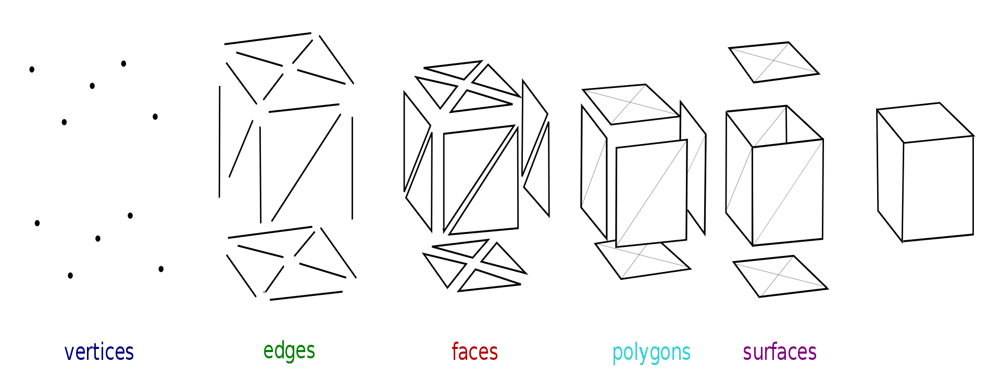

.. _mesh_ref:

What is a mesh?
===========================================================

A mesh is a collection of vertices, edges and faces that defines the shape of a polyhedral object.

* **Vertices**: Representing the x, y and z coordinates/position of corner points of the mesh
* **Edges**: Representing the straight/linear connection between two vertices
* **Faces**: Representing a closed set of edges. Three edges/vertices make up a triangle, four or more make up a polygon. Both polygons and triangles are coplanar, indicating that are located in the same plane.
* **Surfaces**: Representing a collection of faces making up a non-coplanar surface.

Source: https://en.wikipedia.org/wiki/Polygon_mesh

Working with mesh data in GemGIS
~~~~~~~~~~~~~~~~~~~~~~~~~~~~~~~~~~

Mesh data is one of the fundamental data types used in ``GemGIS``. Mesh data is handled by the ``PyVista`` package.

``PyVista`` can work with ``PolyData`` objects and grids (``StructuredGrid``, ``UnstructuredGrid``) consisting of cells and points. Data arrays can be associated with the object holding information such as elevation or depth values, labels or in case of ``MultiBlock`` data the single blocks.

.. image:: ../images/mesh_table.png