.. _projections_ref:

What are projections?
===========================================================

A map projection is a tool to flatten to flatten a globe's surface into a 2D map. This requires a to transform spherical longitude and latitude coordinates from the surface on the globe into X and Y coordinates on a map. The surface of the globe is being distorted when projecting it from 3D to 2D.

Different map projections can be classified depending on the type of projection surface onto which the globe is conceptually projected or according to the properties the model preserves.

Projections by Surface
~~~~~~~~~~~~~~~~~~~~~~

Projections by different surfaces describe how the globe is projected onto a certain projection surface. These surfaces are cylindrical, conic and plane and will be introduced in the following.

Cylindrical Projections
_______________________

A normal cylindrical projection is any projection in which meridians are mapped to equally spaced vertical lines and circles of latitude (parallels) are mapped to horizontal lines. The mapping of meridians to vertical lines can be visualized by imagining a cylinder whose axis coincides with the Earth's axis of rotation. This cylinder is wrapped around the Earth, projected onto, and then unrolled.

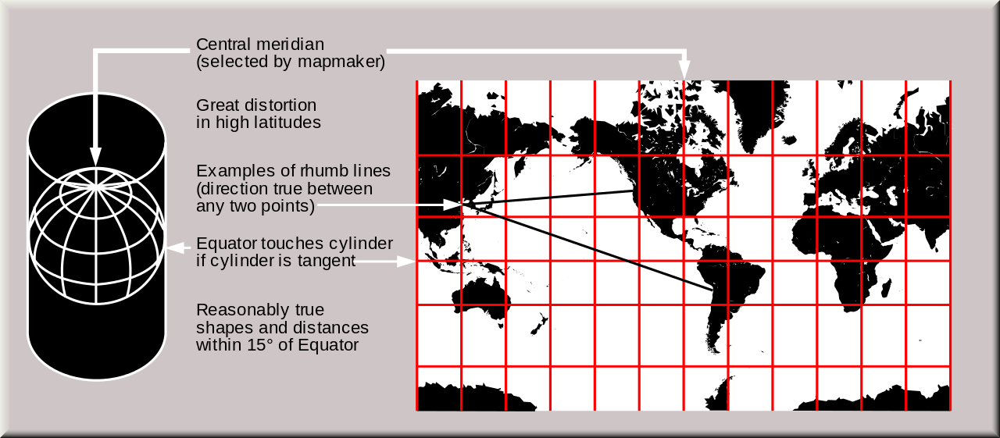

Credit: U.S. Geological Survey

Mercator Projection
^^^^^^^^^^^^^^^^^^^^

The widely known Mercator projection is an example for a cylindrical projection and has become the standard map for navigation. It is representing north as up and south as down while preserving local directions and shapes. The map is conformal (see Classification by Properties of the Model the Projections preserve for more details). As a side effect, the Mercator projection inflates the size of objects away from the equator. This inflation is very small near the equator but accelerates with increasing latitude to become infinite at the poles. So, for example, landmasses such as Greenland and Antarctica appear far larger than they actually are relative to landmasses near the equator, such as Central Africa.

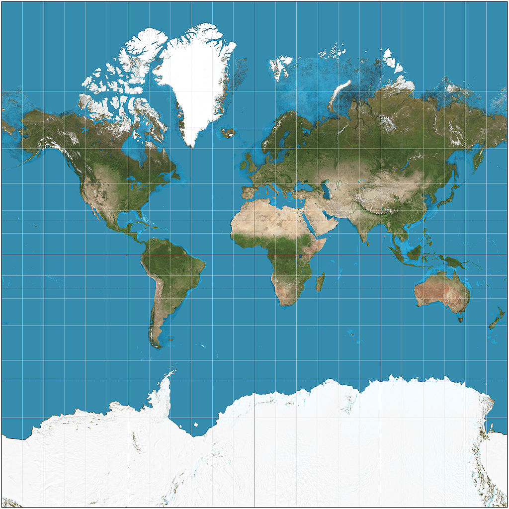

License: `CC BY-SA 3.0 <https://creativecommons.org/licenses/by-sa/3.0/>`_

Transverse Mercator Projection
^^^^^^^^^^^^^^^^^^^^^^^^^^^^^^

The transverse Mercator map projection is an adaptation of the standard Mercator projection. The transverse version is widely used in national and international mapping systems around the world, including the Universal Transverse Mercator. The transverse Mercator projection is the transverse aspect of the standard (or Normal) Mercator projection. They share the same underlying mathematical construction and consequently the transverse Mercator inherits many traits from the normal Mercator.

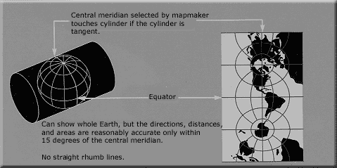

Credit: U.S. Geological Survey

Comparison between Normal and Transverse Mercator Projection
^^^^^^^^^^^^^^^^^^^^^^^^^^^^^^^^^^^^^^^^^^^^^^^^^^^^^^^^^^^^

* Both projections are cylindrical: for the Normal Mercator, the axis of the cylinder coincides with the polar axis and the line of tangency with the equator. For the transverse Mercator, the axis of the cylinder lies in the equatorial plane, and the line of tangency is any chosen meridian, thereby designated the central meridian.
* Both projections may be modified to secant forms, which means the scale has been reduced so that the cylinder slices through the model globe.
* Both exist in spherical and ellipsoidal versions.
* Both projections are conformal, so that the point scale is independent of direction and local shapes are well preserved;
* Both projections have constant scale on the line of tangency (the equator for the normal Mercator and the central meridian for the transverse).

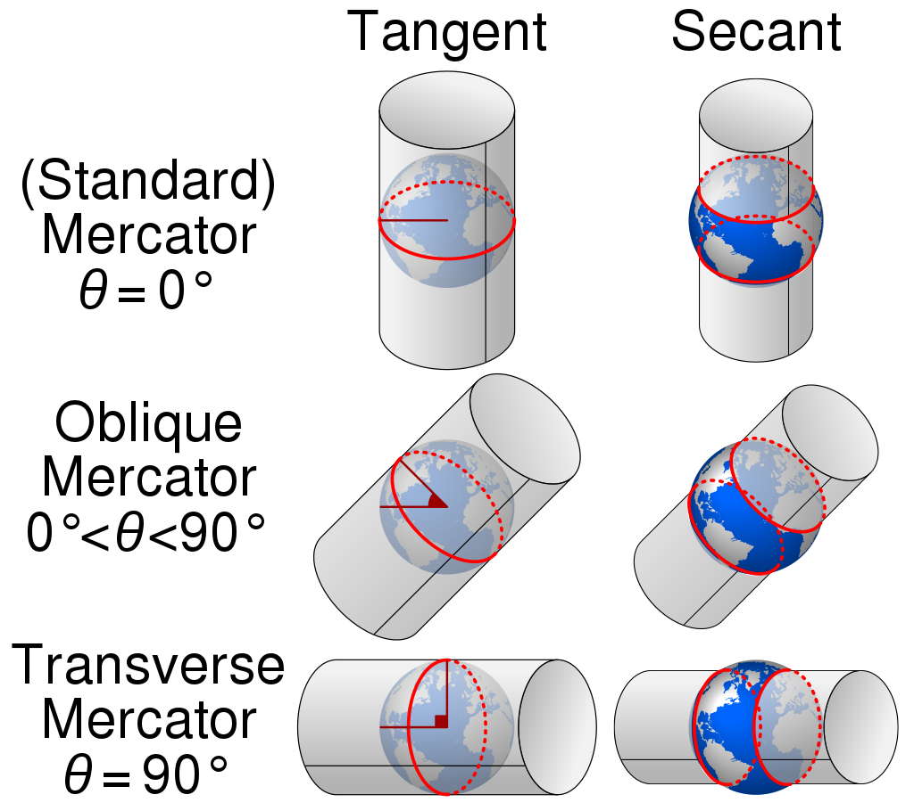

License: `CC BY-SA 4.0 <https://creativecommons.org/licenses/by-sa/4.0/>`_

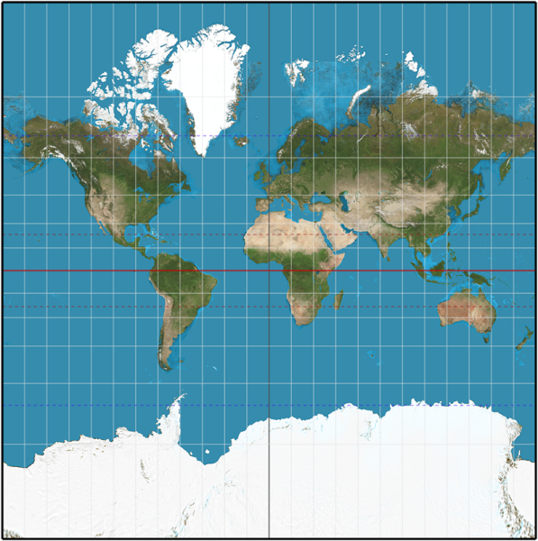

License: `CC BY-SA 3.0 <https://creativecommons.org/licenses/by-sa/3.0/>`_

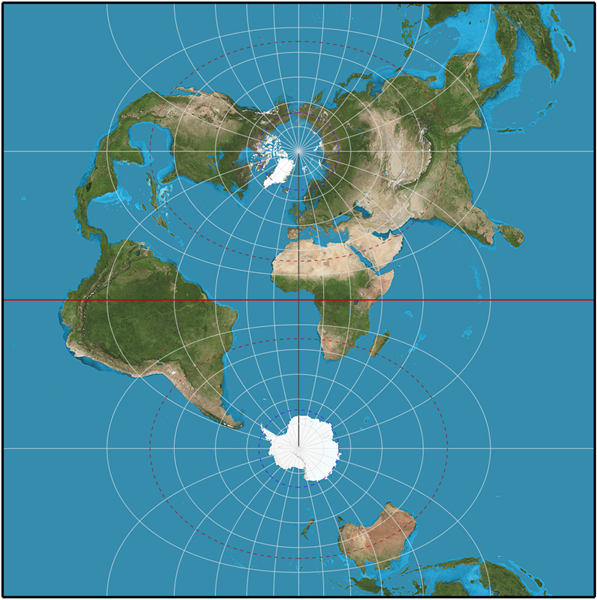

License: `CC BY-SA 3.0 <https://creativecommons.org/licenses/by-sa/3.0/>`_

Universal Transverse Mercator Coordinate System
^^^^^^^^^^^^^^^^^^^^^^^^^^^^^^^^^^^^^^^^^^^^^^^^

The Universal Transverse Mercator (UTM) is a system for assigning coordinates to locations on the surface of the Earth. Like the traditional method of latitude and longitude, it is a horizontal position representation, which means it ignores altitude and treats the earth as a perfect ellipsoid. However, it differs from global latitude/longitude in that it divides earth into 60 zones and projects each to the plane as a basis for its coordinates. Specifying a location means specifying the zone and the x, y coordinate in that plane. The projection from spheroid to a UTM zone is some parameterization of the transverse Mercator projection. The parameters vary by nation or region or mapping system.

Most zones in UTM span 6 degrees of longitude, and each has a designated central meridian. The scale factor at the central meridian is specified to be 0.9996 of true scale for most UTM systems in use.

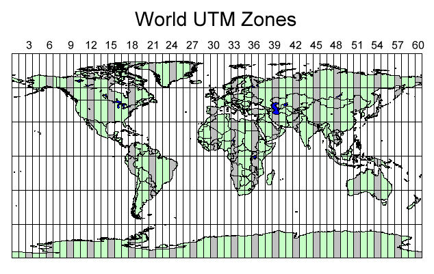

Credit: https://www.xmswiki.com/wiki/File:UTM_world_no_Image_Map.jpg

Lambert cylindrical equal-area Projection
^^^^^^^^^^^^^^^^^^^^^^^^^^^^^^^^^^^^^^^^^^

The Lambert projection is a second example for a cylindrical projection which is also an equal-area projection (see Classification by Properties of the Model the Projections preserve for more details). This projection is undistorted along the equator, which is its standard parallel, but distortion increases rapidly towards the poles. Like any cylindrical projection, it stretches parallels increasingly away from the equator. The poles accrue infinite distortion, becoming lines instead of points.

.. image:: ../images/Lambert_cylindrical_equal-area_projection_SW.jpg

License: `CC BY-SA 3.0 <https://creativecommons.org/licenses/by-sa/3.0/>`_

Conic Projections
_______________________

The term "conic projection" is used to refer to any projection in which meridians are mapped to equally spaced lines radiating out from the apex and circles of latitude (parallels) are mapped to circular arcs centered on the apex. When making a conic map, the map maker arbitrarily picks two standard parallels. Those standard parallels may be visualized as secant lines where the cone intersects the globe—or, if the map maker chooses the same parallel twice, as the tangent line where the cone is tangent to the globe. The resulting conic map has low distortion in scale, shape, and area near those standard parallels. Distances along the parallels to the north of both standard parallels or to the south of both standard parallels are stretched; distances along parallels between the standard parallels are compressed. When a single standard parallel is used, distances along all other parallels are stretched.

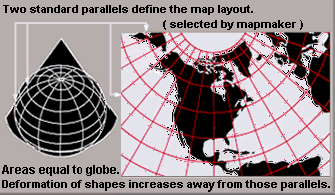

Credit: U.S. Geological Survey

Lambert conformal conic Projection
^^^^^^^^^^^^^^^^^^^^^^^^^^^^^^^^^^^^^^^^^^
A Lambert conformal conic projection (LCC) is a conic map projection used for aeronautical charts, portions of the State Plane Coordinate System, and many national and regional mapping systems. Conceptually, the projection seats a cone over the sphere of the Earth and projects the surface conformally onto the cone. The cone is unrolled, and the parallel that was touching the sphere is assigned unit scale. That parallel is called the reference parallel or standard parallel.

By scaling the resulting map, two parallels can be assigned unit scale, with scale decreasing between the two parallels and increasing outside them. This gives the map two standard parallels. In this way, deviation from unit scale can be minimized within a region of interest that lies largely between the two standard parallels. Unlike other conic projections, no true secant form of the projection exists because using a secant cone does not yield the same scale along both standard parallels.

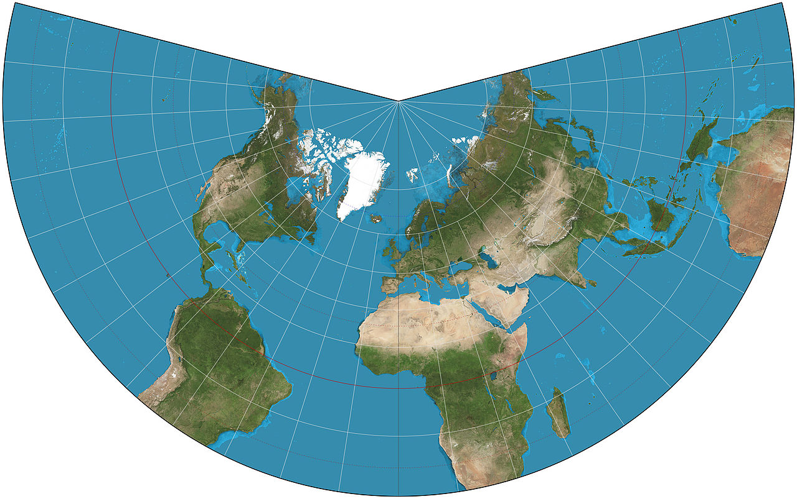

License: `CC BY-SA 3.0 <https://creativecommons.org/licenses/by-sa/3.0/>`_

Azimuthal Projections
_______________________

Azimuthal projections have the property that directions from a central point are preserved and therefore great circles through the central point are represented by straight lines on the map. These projections also have radial symmetry in the scales and hence in the distortions: map distances from the central point are computed by a function r(d) of the true distance d, independent of the angle; correspondingly, circles with the central point as center are mapped into circles which have as center the central point on the map.

The mapping of radial lines can be visualized by imagining a plane tangent to the Earth, with the central point as tangent point.

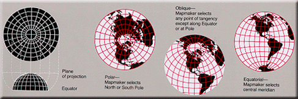

Credit: U.S. Geological Survey

Schmidt Net
^^^^^^^^^^^^

The Schmidt net is a manual drafting method for the Lambert azimuthal equal-area projection using graph paper. It results in one lateral hemisphere of the Earth with the grid of parallels and meridians. It is used in structural geology to visualize orientation values.

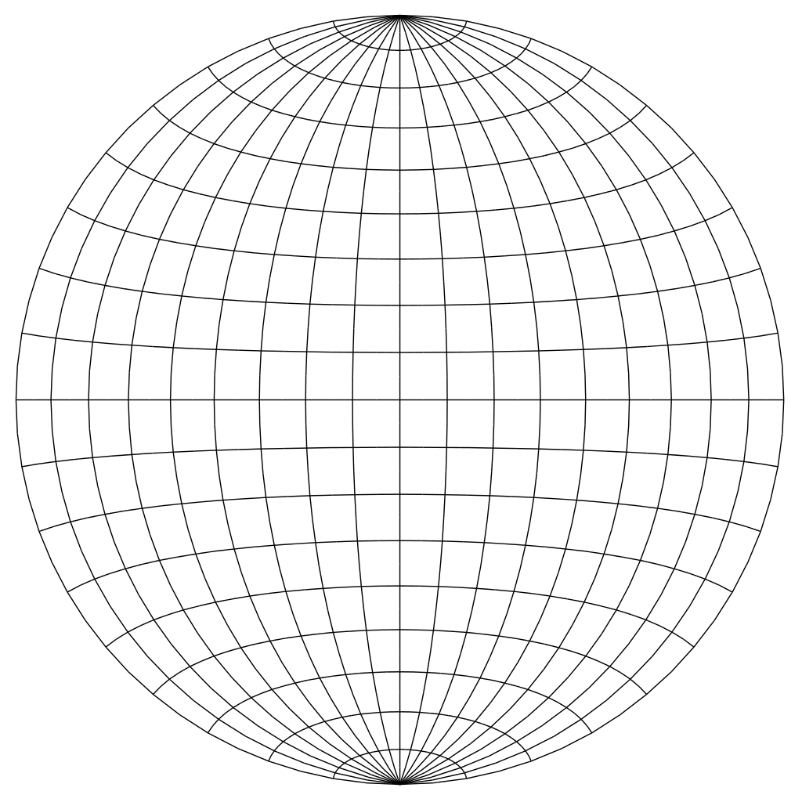

Projections by preservation of a property
~~~~~~~~~~~~~~~~~~~~~~~~~~~~~~~~~~~~~~~~~

Conformal Projections - Preserving shapes locally
_________________________________________________

Conformal, or orthomorphic, map projections preserve angles locally, implying that they map infinitesimal circles of constant size anywhere on the Earth to infinitesimal circles of varying sizes on the map. In contrast, mappings that are not conformal distort most such small circles into ellipses of distortion. An important consequence of conformality is that relative angles at each point of the map are correct, and the local scale (although varying throughout the map) in every direction around any one point is constant.

Examples for conformal projections include:

* Mercator projection
* Lambert projection

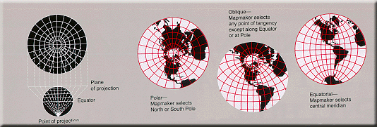

Credit: U.S. Geological Survey

Equal-area Projections - Preserving area
_________________________________________________

Equal-area maps preserve area measure, generally distorting shapes in order to do that. Equal-area maps are also called equivalent or authalic.

Examples of equal-area projections include:

* Lambert azimuthal projection (Schmidt Net)
* Lambert cylindrical projection
* Mollweide projection

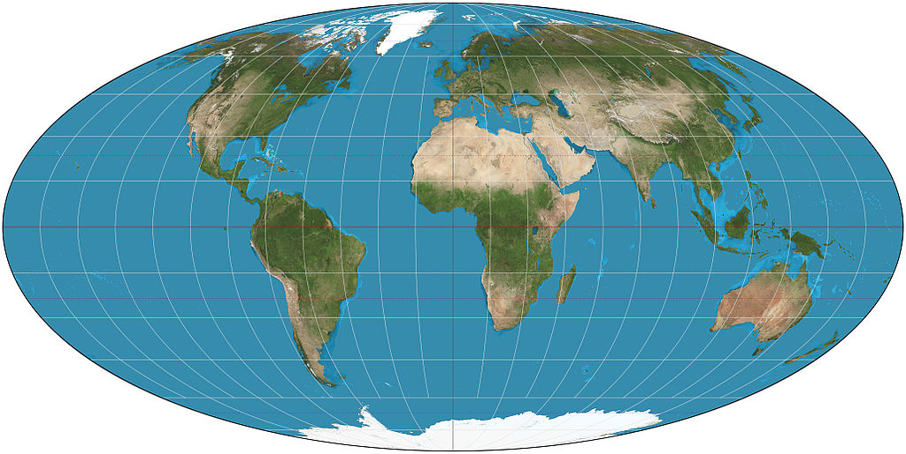

License: `CC BY-SA 3.0 <https://creativecommons.org/licenses/by-sa/3.0/>`_

Equidistant Projections - Preserving distance
_________________________________________________

If the length of the line segment connecting two projected points on the plane is proportional to the geodesic (shortest surface) distance between the two unprojected points on the globe, then we say that distance has been preserved between those two points. An equidistant projection preserves distances from one or two special points to all other points. The special point or points may get stretched into a line or curve segment when projected. In that case, the point on the line or curve segment closest to the point being measured to must be used to measure the distance.

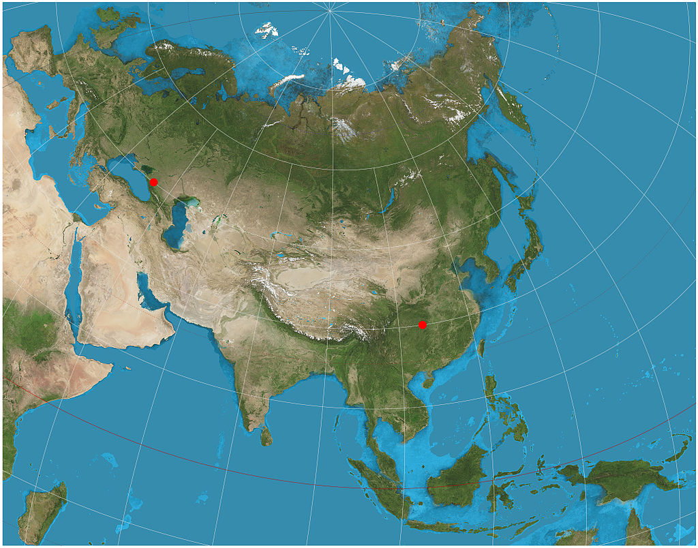

License: `CC BY-SA 3.0 <https://creativecommons.org/licenses/by-sa/3.0/>`_

Other Projections
_________________________________________________

Other projections include gnomonic projections, retroazimuthal and compromise projections (e.g. Robinson projection). Compromise projections for instance give up the idea of perfectly preserving metric properties, seeking instead to strike a balance between distortions, or to simply make things look right. Most of these types of projections distort shape in the polar regions more than at the equator.

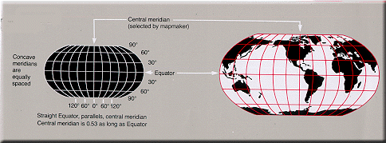

Credit: U.S. Geological Survey

Working with projections and coordinate reference systems in GemGIS
~~~~~~~~~~~~~~~~~~~~~~~~~~~~~~~~~~~~~~~~~~~~~~~~~~~~~~~~~~~~~~~~~~~

The most common task in ``GemGIS`` is to transform or reproject coordinates from one Coordinate Reference System (CRS) to another one. Each CRS represents a coordinate-based local, regional or global system used to locate geographical entities. A Coordinate Reference System defines a specific map projection, as well as transformations between different spatial reference systems. Within ``GemGIS``, this is done by the ``pyproj`` package also utilized by ``GeoPandas`` for instance.

Notation
~~~~~~~~~~~~~~~~~~~~~~

* Aspect: The aspect describes how the developable surface is placed relative to the globe: it may be normal (such that the surface's axis of symmetry coincides with the Earth's axis), transverse (at right angles to the Earth's axis) or oblique (any angle in between)
* Tangent: Tangent means the surface touches but does not slice through the globe
* Secant: Secant means the surface does slice through the globe

Text and Image Sources:

* https://en.wikipedia.org/wiki/Map_projection
* https://en.wikipedia.org/wiki/Mercator_projection
* https://en.wikipedia.org/wiki/Transverse_Mercator_projection
* https://en.wikipedia.org/wiki/Lambert_cylindrical_equal-area_projection
* https://en.wikipedia.org/wiki/Lambert_conformal_conic_projection
* https://en.wikipedia.org/wiki/Schmidt_net
* https://en.wikipedia.org/wiki/Spatial_reference_system
