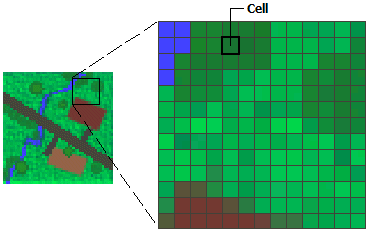
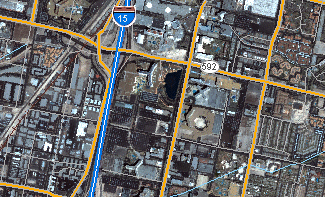
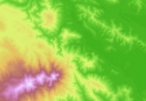
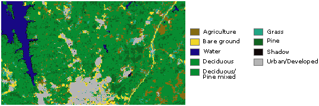

.. _raster_ref:

What is raster data?
===========================================================

In its simplest form, a raster consists of a matrix of cells (or pixels) organized into rows and columns (or a grid) where each cell contains a value representing information, such as the elevation value. Rasters are digital aerial photographs, imagery from satellites, digital pictures, or even scanned maps.

Rasters as base maps
~~~~~~~~~~~~~~~~~~~~

A common use of raster data in a GIS is as a background display for other feature layers. Three main sources of raster basemaps are orthophotos from aerial photography, satellite imagery, and scanned maps.

Rasters as surface maps
~~~~~~~~~~~~~~~~~~~~~~~

Rasters are well suited for representing data that changes continuously across a landscape (surface). Elevation values measured from the earth's surface are the most common application of surface maps, but other values, such as rainfall, temperature, concentration, and population density, can also define surfaces that can be spatially analyzed.

Rasters as thematic maps
~~~~~~~~~~~~~~~~~~~~~~~~

Rasters representing thematic data can be derived from analyzing other data. A common analysis application is classifying a satellite image by land-cover categories. For example, you can process data through a geoprocessing model to create a raster dataset that maps suitability for a specific activity.

Source: https://desktop.arcgis.com/en/arcmap/10.3/manage-data/raster-and-images/what-is-raster-data.htm

Working with raster data in GemGIS
~~~~~~~~~~~~~~~~~~~~~~~~~~~~~~~~~~

Raster data is one of the fundamental data types used in ``GemGIS``. Raster data is handled by the ``Rasterio`` package and the data itself by ``NumPy``.

