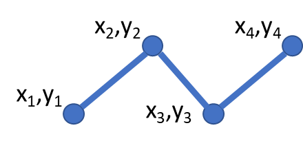
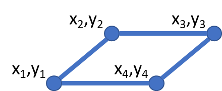

.. _vector_ref:

What is vector data?
===========================================================

Vector data provides a way to represent real world features within a GIS environment. A feature is anything you can see on the landscape. Imagine you are standing on the top of a hill. Looking down, you can see houses, roads, trees, rivers, and so on. Each one of these things would be a feature when we represent them in a GIS application. Vector features have attributes, which consist of text or numerical information that describe the features.

Point Data
~~~~~~~~~~

A point feature has an X, Y and optionally, Z value. The X and Y values will depend on the Coordinate Reference System (CRS) being used. For now, let us simply say, that a CRS is a way to accurately describe where a particular place is on the earth's surface. One of the most common reference systems is Longitude and Latitude. Lines of Longitude run from the North Pole to the South Pole. Lines of Latitude run from the East to West. You can describe precisely where you are at any place on the earth by giving someone your Longitude (X) and Latitude (Y). Since we know the earth is not flat, it is often useful to add a Z value to a point feature. This describes how high above sea level you are.

Line Data
~~~~~~~~~

A line or poly-/multiline is used to show the geometry of linear features such as roads, rivers, contours, footpaths, flight paths and so on. Sometimes, we have special rules for polylines in addition to their basic geometry. For example, contour lines may touch (e.g. at a cliff face) but should never cross over each other. Similarly, polylines used to store a road network should be connected at intersections. In some GIS applications, you can set these special rules for a feature type (e.g. roads) and the GIS will ensure that these polylines always comply to these rules.

Polygon Data
~~~~~~~~~~~~

Polygon features are enclosed areas like dams, islands, country boundaries and so on. Like polyline features, polygons are created from a series of vertices that are connected with a continuous line. However, because a polygon always describes an enclosed area, the first and last vertices should always be at the same place! Polygons often have shared geometry boundaries that are in common with a neighbouring polygon. Many GIS applications have the capability to ensure that the boundaries of neighbouring polygons exactly coincide.

Working with vector data in GemGIS
~~~~~~~~~~~~~~~~~~~~~~~~~~~~~~~~~~

Vector data is one of the fundamental data types used in ``GemGIS``. Vector data is handled by the ``Shapely`` package for single geometries and by the ``PyGEOS`` package for arrays of geometries and vectorized operations performed on these arrays.

Different ``BaseGeometries`` are defined:

* Points/Multi-Points
* Lines/Multi-Lines
* Polygons/Multi-Polygons
* Geometry Collections

The coordinates of the vertices of each element are not associated with a coordinate reference system (CRS) at this point. This is added when collecting multiple objects in a ``GeoPandas`` ``GeoDataFrame``. This ``Pandas`` ``DataFrame``-like object consists of a ``geometry`` column holding the different geometric objects and data columns equal to the attribute fields of shape files. A CRS is usually predefined when loading shape files consisting of geometric objects with ``GeoPandas`` or can be assigned when creating a new ``GeoDataFrame``. It is then possible to perform coordinate transformations on ``GeoDataFrames`` holding a CRS attribute. Different datasets with the same coordinate reference system can the plotted to visualize the spatial distribution of the data.

.. image:: ../images/GeoDataFrame.png