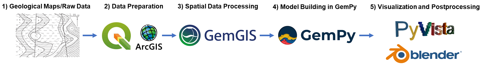
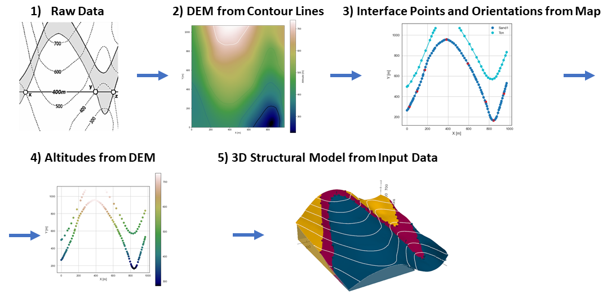

# Summary

**GemGIS** is an open-source Python package for processing spatial data for geological modeling. **GemGIS** wraps and extends the functionality of packages known to the geo-community such as GeoPandas, Rasterio, OWSLib, Shapely, PyGEOS, PyVista, Pandas, NumPy, the geomodelling package GemPy and others. The aim of **GemGIS**, as indicated by the name, is to become a bridge between conventional geoinformation systems (GIS) such as ArcGIS and QGIS, and currently open-source geomodelling tools such as GemPy, enabling simpler and more automated workflows from one software environment to the other. Next to the Github-hosted open-source repository, the package concludes a dedicated documentation page containing detailed installation instructions, tutorials for beginners and more advanced users and sample models to walk users through the entire workflow from creating the data to processing the data and to construct a structural geological model. These examples include the well-known Bennison maps for geological mapping. Functionality for visualizing 3D models is available through the PyVista package and through Blender in the near future.

# Statement of need 

**GemGIS** is intended for students, lecturers, researchers and anyone else working with spatial data with the aim of constructing 3D structural geological models both from example data or real world data for teaching purposes or real world projects. These real world projects may include models for the exploration of deep geothermal energy, carbon capture and storage, nuclear waste disposal or mining activities. The aim of **GemGIS** is hereby to act as a connecting bridge for users being familiar with conventional Geographic Information Systems (GIS) such as ArcGIS or QGIS and currently open-source geomodeling software such as GemPy [@gempy]. Additionally, **GemGIS** builds upon the common data classes such as (Geo-)Pandas (Geo-)DataFrames, NumPy arrays or PyVista meshes. Data collected in the field or geological data obtained from state or country authorities, respectively, can be visualized and preprocessed within a known GIS environment whereas the processing of the available data for geomodeling can be done with **GemGIS** instead of handling multiple versions of CSV files or vector/raster data files such as shape files within a GIS environment. While similar projects such as Map2Loop [@Map2Loop] offer fully-automated workflows based on open-source outcrop and subsurface data, easily accessible in countries like Australia, **GemGIS** aims to offer the user maximum control by automating purely the technical challenges of data integration. Hence, we encourage every user to also work with and understand the data for each model. \

The great advantage of using **GemGIS** in open-source web applications such as Jupyter Notebooks is that processing steps are always reproducible without the need of managing different versions of input data files. This is of extreme importance when dealing with multiple data sources and large volumes of data in general. Traditional GIS systems with graphical user interface are capable of managing this data whereas **GemGIS** will perform the data processing and conversion of input data into formats ready for the construction of structural geological models. However, in comparison to GIS systems, all intermediary results are stored in memory when working within the Python environment. It remains the choice of the user to store intermediary results or only the final results. 

# GemGIS Functionality 
**GemGIS** is capable of working with different types of vector and raster data sets as well as XML-based formats and mesh formats. It is achieved through either parsers that were created for special data formats or through parsers already available in existing packages. And this is the strength of **GemGIS**: Rather than reinventing the wheel, **GemGIS** builds upon well-known packages within the geo-community such as GeoPandas [@geopandas], Rasterio [@rasterio], OWSLib [@owslib], Shapely [@shapely], PyGEOS [@pygeos], PyVista [@pyvista], Pandas [@pandas], NumPy [@numpy], the geomodelling package GemPy [@gempy] and others. **GemGIS** wraps, combines and extends the functionalities of these different packages in order to allow for a more automated processing of spatial data for geomodeling and visualization of input and output data. \

The functionality of **GemGIS** includes:

\begin{itemize}
    \item Editing vector geometries and raster data
    \item Extracting interface point positions from maps, digital elevation models, cross sections and already existing meshes
    \item Calculating orientations and respective positions from maps and cross sections
    \item Obtaining data stored on web servers through OWSLib
    \item Visualizing vector data, raster data (maps and cross sections), meshes and boreholes with PyVista
    \item Post process structural geological models created with GemPy
    
\end{itemize}

# GemGIS Outlook

**GemGIS** is designed to enable a further extension of functionalities in the future. This includes the capability of working with even more data formats through self-written parsers or parsers from already existing packages, working with more geophysically related data such as seismic data, data obtained from borehole geophysics, magnetic and gravitational field measurements and many more. \
A more direct link to Google Earth and a QGIS Plugin are planned. In addition, the creation of data, which is usually done in conventional GIS systems, could also be transferred to a web application. A plugin for the Blender Software to visualize GemPy models is currently under development at the Department for Computational Geoscience and Reservoir Engineering at RWTH Aachen University. 

# GemGIS Resources 

Various tutorials including supplementary data and an elaborative documentation including introductions to various topics related to **GemGIS** and an API Reference are available:

- GemGIS Repository - https://github.com/cgre-aachen/gemgis
- GemGIS Documentation - https://gemgis.readthedocs.io/en/latest/
- GemGIS Installation Instructions - https://gemgis.readthedocs.io/en/latest/getting_started/installation.html
- GemGIS Tutorials - https://gemgis.readthedocs.io/en/latest/getting_started/tutorial/index.html
- GemGIS Tutorial Notebooks - https://rwth-aachen.sciebo.de/s/AfXRsZywYDbUF34/download?path=%2F&files=tutorials01_53.zip

# Acknowledgements

All authors would like to thank the Software Underground (https://softwareunderground.org/) for providing a platform to interact with users and to organize hackathons (Transform 2020/2021) to further develop the open-source packages used here (**GemPy**, **GemGIS**). 
We also acknowledge contributions from, and thank all our users for reporting bugs, raising issues and suggesting improvements to the API of **GemGIS**. 

# References